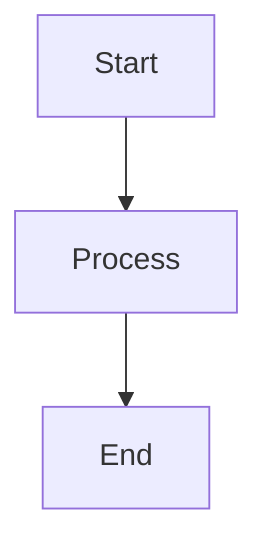
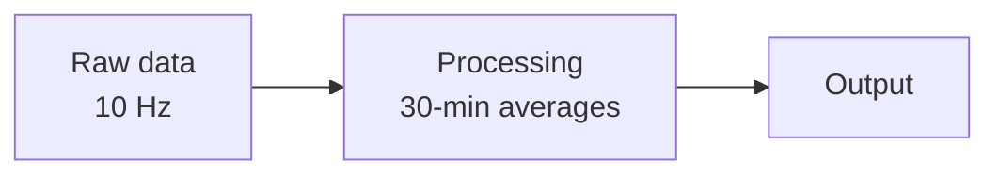
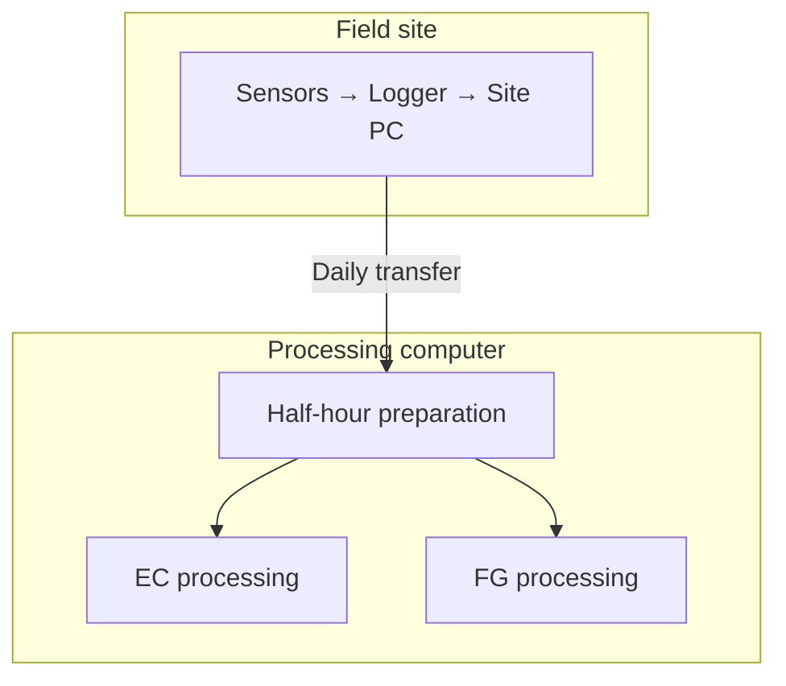
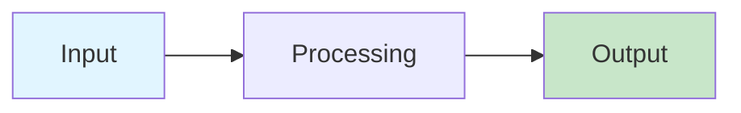

# Contributor Guide

This document is for **new users and collaborators** who want to add content,
update existing pages, or fix errors in the CWR Lab agrometeorology documentation.

It covers everything you need to contribute without breaking the build, the PDF,
or anyone else's work.

---

## Quick Start

### 1. Install and run locally

```bash
# Clone the repository
git clone <repo-url>
cd agromet-docs

# Install Python dependencies (includes the math pre-renderer)
pip install -r requirements.txt

# Install Node.js dependencies (includes the Mermaid diagram renderer)
npm install

# Start the live-preview server
mkdocs serve
```

Open `http://127.0.0.1:8000` in your browser. Every time you save a `.md` file the
page reloads automatically.

### 2. Make your change

Edit or create a file under `docs/`. The preview updates live.

### 3. Build and check the PDF

```bash
mkdocs build
```

Open `site/pdf/document.pdf` and verify your new content looks correct there too.
Diagrams and equations should render without any extra steps.

---

## Adding a New Page

### Step 1 — Create the file

Create a new Markdown file under the appropriate `docs/` subdirectory:

```
docs/
  flux-gradient/
    my-new-topic.md      ← new file
```

Use lowercase, hyphen-separated filenames. Match the style of existing files in
the same directory.

### Step 2 — Register it in the nav

Open `mkdocs.yml` and add your page to the `nav:` section in the right place:

```yaml
nav:
  - Flux-Gradient Analysis:
      - FG Fundamentals:         flux-gradient/fundamentals.md
      - TGA System:              flux-gradient/tga-system.md
      - My New Topic:            flux-gradient/my-new-topic.md   # ← add here
      - Processing Pipeline:     flux-gradient/processing-pipeline.md
```

!!! warning "Register before building"
    If you run `mkdocs build` with a nav entry that points to a non-existent file,
    `mkdocs-to-pdf` **silently drops all PDF pages after that point**. Always create
    the file *before* adding it to the nav, even if it only contains a heading.

### Step 3 — Write content, then verify

```bash
mkdocs serve     # check browser rendering
mkdocs build     # check PDF rendering
```

---

## Page Structure

Every page should follow this pattern:

```markdown
# Page Title

One or two sentences describing what this page covers and who it is for.

---

## Section 1

Content here.

## Section 2

Content here.

---

## Next Steps

- [Related page](other-page.md)
- [Another page](../other-section/page.md)
```

Keep each page focused on **one topic**. If a page grows beyond ~1 500 words,
consider splitting it.

---

## Mermaid Diagrams

Diagrams are rendered to PNG at build time by `hooks/mermaid_prerender.py` using
`mmdc` (Mermaid CLI / headless Chromium). They appear correctly in both the browser
and the PDF automatically — no extra steps needed.

### Basic syntax

Always start a Mermaid block with the diagram type on the first line:

````markdown

````

**Supported types used in this project:**

| Type | Best for |
|------|----------|
| `flowchart TD` / `flowchart TB` | Top-to-bottom process flows |
| `flowchart LR` | Left-to-right flows, short pipelines |
| `graph LR` | Simple node graphs |
| `sequenceDiagram` | Time-ordered interactions between systems |

### Inline labels and `<br>`

Use `<br>` (no slash) for multi-line node labels:



### Subgraphs

Use subgraphs to group related nodes:



### Node styles

Apply colours sparingly to highlight key nodes:



### Best practices

**Do:**
- Always include the diagram type (`flowchart TD`, `graph LR`, etc.)
- Keep diagrams focused — one concept per diagram
- Use left-to-right (`LR`) for long linear pipelines; they produce shorter, wider diagrams
  that fit better on a page than top-to-bottom (`TD`/`TB`) chains of 8+ nodes

**Avoid:**
- Very long top-to-bottom chains (10+ nodes) — they become taller than a screen or PDF page
- Experimental Mermaid features not yet stable in v11
- Hard-coding colours that clash with the light/dark mode toggle

### Troubleshooting diagrams

| Symptom | Cause | Fix |
|---------|-------|-----|
| "Mermaid render failed" admonition | mmdc not installed | `npm install` |
| Empty box, no diagram | Missing diagram type header | Add `flowchart TD` etc. as first line |
| Diagram renders in browser but not PDF | Old cached PNG | `rm -rf docs/assets/mermaid/` then rebuild |
| Diagram text missing in PDF | Old SVG cache from pre-v7 | Same as above |

---

## Math Equations

Equations use LaTeX syntax. They render via **MathJax in the browser** and via
**pre-rendered MathML in the PDF** (handled automatically by `hooks/math_prerender.py`).
The PDF uses the Latin Modern Math font (the same family as LaTeX) so math typography
looks consistent with traditional LaTeX documents.

### Inline equations

Wrap in single dollar signs:

```markdown
The stability parameter $\zeta = (z - d) / L$ controls turbulent mixing.
```

Renders as: The stability parameter $\zeta = (z - d) / L$ controls turbulent mixing.

### Display equations

Wrap in double dollar signs on their own lines:

```markdown
$$
L = -\frac{u_*^3 \cdot T_v}{\kappa \cdot g \cdot \overline{w'T'}}
$$
```

### Common LaTeX snippets used in this project

| What you need | LaTeX | Notes |
|---------------|-------|-------|
| Fraction | `\frac{a}{b}` | |
| Subscript | `u_*` or `u_{*}` | Braces needed for multi-character subscripts |
| Superscript | `u^2` or `u^{1/4}` | |
| Greek letters | `\kappa`, `\zeta`, `\phi`, `\psi` | |
| Overline (mean) | `\overline{w'T'}` | |
| Partial derivative | `\frac{\partial c}{\partial z}` | |
| Square root | `\sqrt{\frac{1}{N}}` | |
| Sum | `\sum_{i=1}^{N}` | |
| Natural log | `\ln\left(\frac{a}{b}\right)` | Use `\left(` `\right)` for auto-sizing |
| Multiplication dot | `\cdot` | |
| Approximately | `\approx` | |
| Text inside math | `\text{ m s}^{-1}` | |

### Best practices

**Do:**
- Use `\left(` and `\right)` around parentheses that contain tall content like fractions
- Include units in `\text{...}` after the expression
- Break very long display equations across multiple `$$` blocks with a short explanation
  between them rather than cramming everything into one

**Avoid:**
- Inline equations for anything longer than ~5 tokens — use display style instead
- The `\!` negative-space command — it is stripped by the MathML converter
- Packages not supported by `latex2mathml` (e.g., `\usepackage{...}`) — these are
  browser-document equations, not full LaTeX documents

### How variable italics work in the PDF

In the browser, MathJax automatically italicises single-letter math identifiers
(*K*, *z*, *κ*). In the PDF, `hooks/math_prerender.py` achieves the same result by
substituting each such character with its Unicode Mathematical Italic code point (e.g.
`z` → `𝑧`, `κ` → `𝜅`) before injecting the MathML. This uses designed glyph shapes
from the Latin Modern Math font rather than a geometric slant.

Greek uppercase letters (Δ, Σ, Ω …) are intentionally kept upright, matching
standard LaTeX convention where they represent operators and constants.

You do not need to do anything special — this happens automatically for all equations.

### Troubleshooting equations

| Symptom | Cause | Fix |
|---------|-------|-----|
| Raw LaTeX in browser | MathJax not loaded | Check `mathjax.js` is listed *before* `tex-mml-chtml.js` in `mkdocs.yml` |
| Raw LaTeX in PDF | `latex2mathml` not installed | `pip install latex2mathml` |
| One equation shows raw LaTeX in PDF, others fine | Unsupported LaTeX command | Check build log for `[math_prerender] LaTeX→MathML failed` and simplify that equation |
| `<`, `>`, `&` show as `&lt;` `&gt;` `&amp;` in PDF | `arithmatex` HTML-escapes these before the hook sees the LaTeX; `latex2mathml` then treats them as text | Fixed in current hook via `html.unescape()` before conversion; if it reappears, check `_convert()` in `math_prerender.py` |
| Fractions appear as flat text in PDF | Missing MathML CSS rules | Verify `extra.css` contains the WeasyPrint MathML layout block |
| PDF math looks sans-serif / wrong font | `docs/fonts/latinmodern-math.otf` missing or path wrong | Check `setup_and_maintenance.md` §6 |

---

## Admonitions (Callout Boxes)

Admonitions draw attention to important content. Use them sparingly — if everything
is highlighted, nothing is.

### Syntax

```markdown
!!! note "Optional custom title"
    Content goes here, indented by 4 spaces.
    Can span multiple paragraphs.
```

### Types used in this project

| Type | Use for |
|------|---------|
| `note` | Additional context that is helpful but not critical |
| `info` | Background information or definitions |
| `tip` | Best practices and recommended approaches |
| `warning` | Things that could go wrong or require extra care |
| `danger` | Critical parameters; mistakes that damage data or instruments |
| `example` | Worked examples with numbers |
| `question` / `success` | Q&A pairs (question + answer) |

### Example

```markdown
!!! warning "Keep nav in sync with existing files"
    If a nav entry references a file that does not exist, `mkdocs-to-pdf`
    drops all PDF pages after that entry.
    Only add nav entries for files that actually exist.
```

---

## Tables

Use Markdown tables for structured data. Align columns with consistent spacing:

```markdown
| Parameter | Value | Notes |
|-----------|-------|-------|
| κ | 0.40 | von Kármán constant |
| g | 9.81 m s⁻² | Guelph, ~43.5 °N |
```

For **QA/QC threshold tables**, follow the pattern used in `flux-gradient/tga-system.md`:

```markdown
| Parameter | Min | Max | Flag Action |
|-----------|-----|-----|-------------|
| Sample Pressure | 50 mb | 80 mb | Check pump/filters |
```

---

## Code Blocks

Use fenced code blocks with a language identifier:

````markdown
```python
# Python example
result = db_calc_FG(siteID, dateStr)
```

```matlab
% MATLAB example
dbIni = db_get_site_ini(siteID, dateStr);
```

```bash
mkdocs build
```
````

Use inline code for file names, function names, and short commands: `` `mkdocs.yml` ``,
`` `db_update_site.m` ``.

---

## Images

Place image files under `docs/images/`. Reference them with a relative path:

```markdown

*Figure caption goes here as italic text below the image.*
```

**Guidelines:**
- Use `.png` for diagrams and screenshots; `.jpg` for photographs
- Keep files under 500 KB; optimise large images before committing
- Always provide meaningful alt text — it appears in the PDF if the image is missing
- Add a caption (italic text directly below the `` line)

---

## Videos and Embedded Content

Wrap all `<iframe>` and `<video>` elements in the `.video-embed` div to ensure they are
hidden in the PDF (WeasyPrint cannot render iframes). Add a `.video-placeholder` sibling
for the PDF fallback text:

```html
<div class="video-embed">
  <iframe src="https://www.youtube.com/embed/YOUR_VIDEO_ID"
          frameborder="0" allowfullscreen></iframe>
</div>
<div class="video-placeholder">
  📹 Video: Title of the video — available in the online documentation.
</div>

*Caption: Brief description of what the video shows.*
```

**Without the `.video-embed` wrapper**, WeasyPrint may fail to render all PDF pages
after the iframe.

---

## Cross-References and Links

### Between pages in the docs

Use relative paths from the current file's location:

```markdown
<!-- From docs/flux-gradient/fundamentals.md -->
See the [TGA System](tga-system.md) page.
See the [Processing Pipeline](../processing/flux_gradient_pipeline.md) page.
```

### To external URLs

```markdown
See the [MkDocs documentation](https://www.mkdocs.org/).
```

### To headings on the same page

```markdown
See [Physical Constants](#physical-constants) above.
```

(The anchor is the heading text, lowercased, with spaces replaced by hyphens.)

---

## The PDF: What Works and What Doesn't

The PDF is generated by WeasyPrint, which renders HTML without executing JavaScript
and with limited CSS support. A few things to keep in mind:

| Feature | Browser | PDF | Notes |
|---------|---------|-----|-------|
| Mermaid diagrams | ✓ | ✓ | Pre-rendered as PNG data URIs |
| Math equations | ✓ | ✓ | Pre-rendered as MathML with Latin Modern Math font; matches LaTeX typography |
| `<iframe>` / `<video>` | ✓ | hidden | Use `.video-embed` wrapper |
| Dark/light mode toggle | ✓ | n/a | PDF always uses light theme |
| Collapsible `???` blocks | ✓ | ✗ (hidden) | Use `!!!` (always-open) instead |
| Tabs (`=== "Tab"`) | ✓ | ✗ | Avoid in content that must be in PDF |
| Emoji | ✓ | ✓ | Renders as SVG icons |
| Code highlighting | ✓ | ✓ | |

!!! tip "Test the PDF before committing"
    Run `mkdocs build` and open `site/pdf/document.pdf` to verify your additions
    look correct before pushing. Browser rendering alone is not sufficient.

---

## Common Mistakes

### Mistake 1 — Adding a nav entry before the file exists

```yaml
# mkdocs.yml
nav:
  - My New Page: my-new-page.md   # ← file doesn't exist yet
```

**Result:** Every PDF page after this entry is silently dropped.
**Fix:** Create the file first, even if it's just a title and one sentence.

### Mistake 2 — Using `???` (collapsible) instead of `!!!`

```markdown
??? "Click to expand"
    Hidden content here.
```

**Result:** Content is hidden in the PDF (WeasyPrint renders `<details>` as closed).
**Fix:** Use `!!!` for any content that must appear in the PDF:

```markdown
!!! note "Previously collapsed content"
    Content visible in browser and PDF.
```

### Mistake 3 — Bare `<iframe>` without a wrapper

```html
<!-- Bad -->
<iframe src="https://www.youtube.com/embed/..."></iframe>

<!-- Good -->
<div class="video-embed">
  <iframe src="https://www.youtube.com/embed/..."></iframe>
</div>
<div class="video-placeholder">📹 Video — see online documentation.</div>
```

**Result (bad):** WeasyPrint may abort rendering everything after the bare iframe.

### Mistake 4 — Very long top-to-bottom flowcharts

A `flowchart TB` with 12+ nodes in a linear chain produces a PNG taller than an A4 page.
The PDF will scale it down to 190 mm, which can make text hard to read.

**Fix:** Split into two diagrams, or switch to `flowchart LR` if the layout permits.

### Mistake 5 — Breaking math with unsupported LaTeX

```markdown
<!-- May not convert to MathML -->
$$\require{cancel} \cancel{x}$$
```

**Result:** Raw LaTeX appears in the PDF for that equation (browser is unaffected).
**Fix:** Stick to standard LaTeX commands. Check the build log for
`[math_prerender] LaTeX→MathML failed` messages.

---

## Deployment (GitHub Pages)

When you push to `main`, the GitHub Actions workflow at
`.github/workflows/deploy.yml` runs automatically and publishes the site to
GitHub Pages — you don't need to do anything extra.

The workflow: checks out the repo → installs Python deps → installs Node/mmdc →
runs `mkdocs gh-deploy --force`, which builds the site and pushes it to the
`gh-pages` branch. You can watch the progress under the **Actions** tab on GitHub.

### What to commit (and what not to)

| Path | Commit? | Why |
|------|---------|-----|
| `docs/assets/mermaid/*.png` | ✓ yes | PNG cache — CI skips re-rendering unchanged diagrams |
| `docs/javascripts/vendor/mathjax/` | ✓ yes | Runtime asset, not a build tool |
| `docs/fonts/latinmodern-math.otf` | ✓ yes | Static asset needed by WeasyPrint |
| `package-lock.json` | ✓ yes | Pins exact mmdc + Chromium version |
| `puppeteer.config.json` | ✓ yes | Puppeteer launch flags for CI |
| `node_modules/` | ✗ no | Installed by CI via `npm ci` |
| `site/` | ✗ no | Generated by CI; published to `gh-pages` branch |

### puppeteer.config.json — must stay valid JSON

`puppeteer.config.json` supplies `--no-sandbox` flags so Chromium can run on
GitHub Actions runners. mmdc reads it with `JSON.parse()`, so it **must be pure
JSON** — no comments, no `module.exports`. If it is ever accidentally edited into
a JS module, every diagram build will fail with:

```
SyntaxError: Unexpected token '/', "/**..." is not valid JSON
```

The correct content is just:

```json
{
  "args": ["--no-sandbox", "--disable-setuid-sandbox"]
}
```

---

## Keeping Things Tidy

- **One canonical place per concept.** If two pages both need to explain the Obukhov
  length, one should define it and the other should link to it.
- **Update, don't duplicate.** When changing a value (e.g., a QC threshold), find
  every place it appears and update all of them.
- **Keep stubs out of the nav.** If a page is not ready, don't add it to `mkdocs.yml`
  until it has real content.
- **Check both browser and PDF** after significant changes.
- **Write for the next person.** Assume the reader knows the science but not the
  specific implementation decisions made here.

---

## Getting Help

If something in the build breaks unexpectedly:

1. Run `mkdocs build --verbose 2>&1 | tee build.log` and read the log
2. Check the troubleshooting sections in `setup_and_maintenance.md`
3. For Mermaid issues: `node_modules/.bin/mmdc --version` (should print the version)
4. For math issues: `python -c "import latex2mathml; print('ok')"` (should print `ok`)
5. Clear caches and retry: `rm -rf docs/assets/mermaid/ site/ && mkdocs build`
