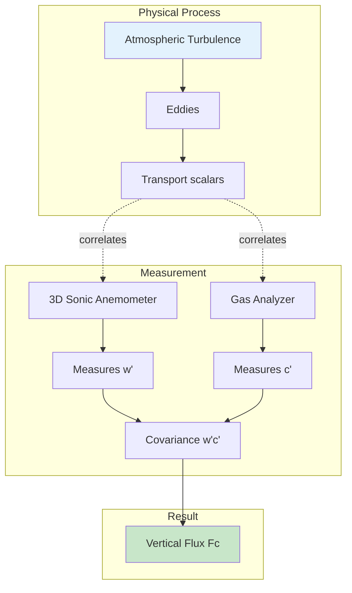
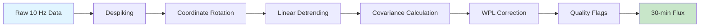

# Eddy Covariance Fundamentals

## What is Eddy Covariance?

The **Eddy Covariance (EC) method** directly measures turbulent fluxes by computing the covariance between high-frequency fluctuations in vertical wind velocity and the scalar of interest (e.g., CO₂, H₂O, temperature).

*Figure: Eddy covariance measures turbulent transport by correlating vertical wind with scalar concentrations*

## Theoretical Basis

### Reynolds Decomposition

Any atmospheric variable can be decomposed into mean and fluctuating components:

$$
c = \overline{c} + c'
$$

where:

- $c$ = instantaneous concentration
- $\overline{c}$ = time-averaged mean concentration
- $c'$ = turbulent fluctuation from the mean

### The Flux Equation

The vertical flux of a scalar is calculated as:

$$
F_c = \overline{w'c'}
$$

where:

- $F_c$ = vertical flux of scalar $c$
- $w'$ = vertical wind velocity fluctuation
- $c'$ = scalar concentration fluctuation
- Overbar denotes time averaging

!!! note "Why This Works"
    When upward air motion ($w' > 0$) consistently carries higher concentrations ($c' > 0$), the covariance $\overline{w'c'}$ is positive, indicating upward flux. The method captures the actual turbulent transport without requiring assumptions about the transfer mechanism.

## Key Assumptions

The EC method relies on several assumptions:

### 1. Stationarity
Turbulent statistics should not change over the averaging period (typically 30 minutes).

**Check**: Divide 30-min period into sub-periods and verify similar statistics.

### 2. Horizontal Homogeneity
Surface properties should be uniform in the flux footprint.

**Implication**: Site selection is critical for representative measurements.

### 3. Negligible Advection
Horizontal and vertical advection should be small compared to turbulent flux.

**When violated**: Over complex terrain or with strong mesoscale flows.

### 4. Complete Turbulent Sampling
The averaging period must capture all relevant turbulent eddies.

**Typical requirement**: 30-60 minute averaging periods.

## Measurement Principle Diagram

## Flux Calculations

### Basic Steps

#### 1. Coordinate Rotation

Rotate coordinate system so mean vertical velocity is zero:

- **Double rotation**: Most common method
- **Planar fit**: For complex terrain (requires long-term data)

#### 2. Linear Detrending

Remove low-frequency trends that aren't turbulent:

$$
x'(t) = x(t) - [a + bt]
$$

#### 3. Covariance Calculation

For CO₂ flux:

$$
F_{CO_2} = \overline{w'c'} = \frac{1}{N}\sum_{i=1}^{N} w'_i \cdot c'_i
$$

#### 4. WPL Correction

**Webb-Pearman-Leuning (WPL) correction** accounts for density effects:

$$
F_{CO_2,corrected} = F_{CO_2,measured} + \mu \cdot \overline{c} \cdot E + (1 + \mu \cdot \sigma) \cdot \overline{c} \cdot \frac{H}{\overline{T}}
$$

where:

- $E$ = water vapor flux
- $H$ = sensible heat flux  
- $\mu$ = ratio of molecular masses
- $\sigma$ = ratio of molar densities

!!! warning "Critical for Open-Path Sensors"
    WPL corrections are essential for open-path analyzers and can be 10-20% of measured flux.

## Example Fluxes

### CO₂ Flux

**Daytime (Photosynthesis)**:

$$
F_{CO_2} < 0 \quad \text{(uptake)}
$$

**Nighttime (Respiration)**:

$$
F_{CO_2} > 0 \quad \text{(emission)}
$$

### Latent Heat Flux

Evapotranspiration from surface:

$$
LE = \lambda \cdot E = \lambda \cdot \overline{w'\rho_v'}
$$

where:

- $\lambda$ = latent heat of vaporization (2.45 MJ/kg)
- $E$ = water vapor flux
- $\rho_v$ = water vapor density

### Sensible Heat Flux

$$
H = \rho \cdot c_p \cdot \overline{w'T'}
$$

where:

- $\rho$ = air density
- $c_p$ = specific heat of air (1005 J/kg/K)
- $T$ = temperature

### Momentum Flux (Friction Velocity)

$$
u_* = \left[\left(\overline{u'w'}\right)^2 + \left(\overline{v'w'}\right)^2\right]^{1/4}
$$

Friction velocity ($u_*$) characterizes turbulent intensity and is crucial for:

- Flux-gradient calculations
- Footprint modeling
- Quality control

## Typical Values

### Daily Cycle Example

| Time | CO₂ Flux (μmol/m²/s) | H (W/m²) | LE (W/m²) | u* (m/s) |
|------|----------------------|------------|-------------|------------|
| 06:00 | +2 | -20 | 50 | 0.15 |
| 12:00 | -15 | 250 | 300 | 0.45 |
| 18:00 | +5 | 80 | 150 | 0.30 |
| 24:00 | +8 | -30 | 20 | 0.12 |

!!! note "Sign Conventions"
    - **Negative flux**: Downward (into surface)
    - **Positive flux**: Upward (from surface)
    
    For CO₂: Negative = ecosystem uptake (photosynthesis)

## Data Quality Considerations

### High-Quality Data Requires:

✓ **Sufficient turbulence**: $u_* > 0.1$ m/s (threshold varies by site)  
✓ **Stationarity**: Flux covariance quality test  
✓ **Horizontal homogeneity**: Footprint within target area  
✓ **Proper sensor function**: No spikes, offsets, or drift  
✓ **Complete data**: < 10% missing high-frequency data

### Common Issues

=== "Insufficient Turbulence"
    **Problem**: Stable atmospheric conditions (nighttime)  
    **Solution**: Use $u_*$ threshold filtering
    
=== "Sensor Malfunction"
    **Problem**: Dirty optics, calibration drift  
    **Solution**: Regular maintenance and calibration
    
=== "Rain Events"
    **Problem**: Water on sensor windows  
    **Solution**: Automated detection and flagging

## Interactive Visualization

<!-- Example: Embedded interactive plot -->

  <iframe src="../diagrams/daily-flux-cycle.html" width="100%" height="500px" frameborder="0"></iframe>

📹 Interactive figure: Typical daily flux patterns — see online documentation — available in the online documentation at the project site.

*Interactive Figure: Typical daily flux patterns (hover for details)*

## Video Lecture: EC Theory

  <iframe src="https://www.youtube.com/embed/ec-theory-video" frameborder="0" allowfullscreen></iframe>

📹 Video: Eddy covariance theory and practice (30 min) — see online documentation — available in the online documentation at the project site.

📹 Interactive figure: Typical daily flux patterns — see online documentation — available in the online documentation at the project site.

*Video: Eddy covariance theory and practice (30 minutes)*

## Further Reading

!!! info "Recommended Papers"
    1. **Baldocchi, D.D. (2014)**. "Measuring fluxes of trace gases and energy between ecosystems and the atmosphere." *Global Change Biology*, 20, 3600-3609. [Foundation paper]
    
    2. **Webb et al. (1980)**. "Correction of flux measurements for density effects." *QJRMS*, 106, 85-100. [WPL correction]
    
    3. **Moncrieff et al. (1997)**. "A system to measure surface fluxes." *Journal of Hydrology*, 188-189, 589-611. [Practical implementation]

---

## Next Steps

- [EC Variables](variables.md) - Detailed variable definitions
- [Data Processing](processing.md) - Step-by-step processing workflow
- [Quality Control](quality-control.md) - QA/QC procedures
