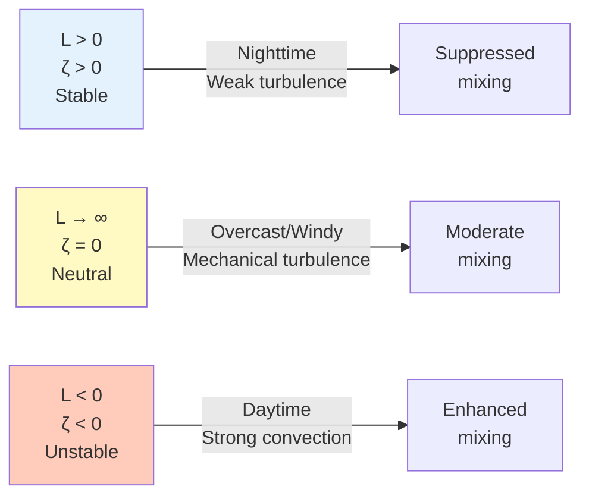
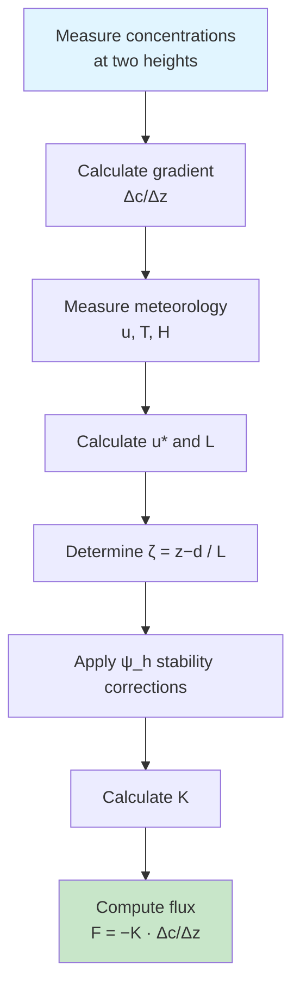

# Flux-Gradient Fundamentals

## What is the Flux-Gradient Method?

The **Flux-Gradient (FG) method** estimates vertical fluxes by measuring concentration or temperature
gradients and relating them to turbulent exchange through **Monin-Obukhov Similarity Theory (MOST)**.

The CWR Lab FG system — developed by the Wagner-Riddle group at the University of Guelph —
measures **N₂O and CO₂** fluxes using the Campbell Scientific TGA100A and a dual-height intake
arrangement on each measurement plot.

*Figure: Flux-gradient method uses vertical gradients and turbulent diffusivity*

---

## Physical Constants

The MATLAB pipeline uses the following physical constants, appropriate for the University of Guelph
site location (~43.5 °N):

| Constant | Symbol | Value | Units |
|----------|--------|-------|-------|
| von Kármán constant | κ | 0.40 | — |
| Gravitational acceleration | g | 9.81 | m s⁻² |
| Universal gas constant | R | 8.31451 | J mol⁻¹ K⁻¹ |
| Specific gas constant (dry air) | R_d | 287.05 | J kg⁻¹ K⁻¹ |
| Molar mass of dry air | M_air | 28.96 | g mol⁻¹ |
| Molar mass of CO₂ | M_CO₂ | 44.01 | g mol⁻¹ |
| Molar mass of N₂O | M_N₂O | 44.01 | g mol⁻¹ |

!!! note "Gravity at Guelph"
    g = 9.81 m s⁻² is the appropriate value for ~43.5 °N latitude.
    Gravitational acceleration increases toward the poles due to Earth's oblate shape
    and rotation; using a geographically accurate value reduces systematic error in the
    Obukhov length calculation.

---

## Theoretical Foundation

### Basic Principle

Flux is proportional to the concentration gradient:

$$
F_c = -K_c \frac{\partial c}{\partial z}
$$

where:

- $F_c$ = vertical flux of scalar $c$
- $K_c$ = eddy diffusivity for scalar $c$ (m² s⁻¹)
- $\frac{\partial c}{\partial z}$ = vertical concentration gradient

!!! note "The Challenge"
    Unlike molecular diffusion where diffusivity is constant, **eddy diffusivity** $K_c$
    varies with atmospheric stability, wind speed, and measurement height.
    MOST provides the theoretical framework to determine $K_c$.

---

## Monin-Obukhov Similarity Theory (MOST)

### Obukhov Length

Atmospheric stability is characterised by the **Obukhov length** $L$:

$$
L = -\frac{u_*^3 \cdot T_v}{\kappa \cdot g \cdot \overline{w'T'}}
$$

where:

- $u_*$ = friction velocity (m s⁻¹)
- $T_v$ = virtual temperature (K) — the MATLAB pipeline uses virtual temperature
  (rather than sonic temperature alone) to apply a proper humidity correction
- $\kappa$ = 0.40 (von Kármán constant)
- $g$ = 9.81 m s⁻²
- $\overline{w'T'}$ = kinematic sensible heat flux (K m s⁻¹)

### Stability Parameter

The dimensionless stability parameter:

$$
\zeta = \frac{z - d}{L}
$$

where $z$ is measurement height (m) and $d$ is zero-plane displacement (m).

### Atmospheric Stability Classes

**Valid stability range used by the pipeline:**

| Condition | Threshold | Action |
|-----------|-----------|--------|
| Very stable | ζ > 2 | K set to NaN — excluded from flux calculation |
| Very unstable | ζ < −5 | K set to NaN — excluded from flux calculation |
| Near-neutral | \|ζ\| ≤ 0.01 | Neutral functions applied |

---

## Friction Velocity

The pipeline computes $u_*$ from the 3-D sonic anemometer covariances:

$$
u_* = \left( \overline{u'w'}^2 + \overline{v'w'}^2 \right)^{1/4}
$$

Double coordinate rotation is applied first in `db_process_hhour_sonic` to align the
mean wind vector with the $x$-axis before computing turbulent covariances.

!!! info "Cup anemometer fallback"
    Code for a cup-anemometer-based $u_*$ (iterative log-profile) exists in the MATLAB
    pipeline but is disabled. $u_*$ is always derived from the sonic anemometer.

### Gap-Filling Strategy for u*

When sonic-derived $u_*$ is unavailable for a plot, the pipeline applies the following
fallback hierarchy:

1. **Sonic u\*** from the same plot (primary)
2. **Adjacent-plot u\*** — used when the crop height difference satisfies
   $|h_{\text{diff}}|/h_{\text{mean}} < 1$ (i.e., within 100 % of the mean crop height)
3. **No flux computed** — if no valid $u_*$ source is available

---

## Stability Functions (Businger-Dyer)

The pipeline uses the **Businger-Dyer formulation with coefficient 15**, implemented in
both the flux function $\phi_h$ and its integrated form $\psi_h$.

### Stability function φ_h

| Condition | Formula |
|-----------|---------|
| Stable (ζ > 0) | $\phi_h = 1 + 4.7\zeta$ |
| Neutral (\|ζ\| ≤ 0.01) | $\phi_h = 1$ |
| Unstable (ζ < 0) | $\phi_h = (1 - 15\zeta)^{-0.5}$ |

### Integrated stability correction ψ_h

Used in the eddy diffusivity calculation:

| Condition | Formula |
|-----------|---------|
| Stable (ζ > 0) | $\psi_h = -4.7\zeta$ |
| Neutral (\|ζ\| ≤ 0.01) | $\psi_h = 0$ |
| Unstable (ζ < 0) | $\psi_h = 2\ln\!\left(\dfrac{1 + x^2}{2}\right)$, where $x = (1 - 15\zeta)^{0.25}$ |

---

## Canopy Parameters

The MATLAB pipeline derives displacement height and roughness length from crop height
$h_c$, using the following empirically calibrated factors for the Guelph agricultural sites:

| Parameter | Symbol | Formula | Notes |
|-----------|--------|---------|-------|
| Zero-plane displacement | $d$ | $0.67 \times h_c$ | Standard agricultural value |
| Roughness length | $z_0$ | $0.13 \times h_c$ | Site-calibrated; ~30 % larger than the classic 0.10 factor |

Both parameters are defined per-site in the `*_init_all.m` initialization file and can be
updated using dated epochs as crop height changes seasonally.

---

## Eddy Diffusivity

The integrated eddy diffusivity $K$ is computed from the two sampling heights $z_1$ and $z_2$:

$$
K = \frac{\kappa \cdot u_* \cdot \Delta z}
      {\ln\!\left(\dfrac{z_2 - d}{z_1 - d}\right)
       - \psi_h\!\left(\dfrac{z_2 - d}{L}\right)
       + \psi_h\!\left(\dfrac{z_1 - d}{L}\right)}
$$

where $\Delta z = z_2 - z_1$.

---

## Flux Calculation

### Step-by-Step Process

### Practical Equation

For concentrations measured at heights $z_1$ and $z_2$:

$$
F_c = -K \cdot \frac{c_2 - c_1}{z_2 - z_1}
$$

In full integrated form:

$$
F_c = -\frac{\kappa \cdot u_* \cdot (c_2 - c_1)}
       {\ln\!\left(\dfrac{z_2-d}{z_1-d}\right)
        - \psi_h\!\left(\dfrac{z_2-d}{L}\right)
        + \psi_h\!\left(\dfrac{z_1-d}{L}\right)}
$$

### Example Calculation

!!! example "Simple Case: Neutral Conditions"
    Given:

    - $c_1 = 410$ ppm at $z_1 = 0.5$ m
    - $c_2 = 405$ ppm at $z_2 = 2.5$ m
    - $u_* = 0.3$ m s⁻¹
    - Neutral stability ($\psi_h = 0$, $\phi_h = 1$)
    - $d = 0.2$ m (0.67 × 0.3 m crop)

    $$K = \frac{0.40 \times 0.3 \times 2.0}{\ln(2.3/0.3)} = \frac{0.240}{2.037} = 0.118 \text{ m}^2\text{s}^{-1}$$

    $$F_{CO_2} = -0.118 \times \frac{405-410}{2.0} = +0.295 \text{ ppm m s}^{-1}$$

---

## Output Units

| Gas | MATLAB Output Units |
|-----|-------------------|
| N₂O | ng N₂O-N m⁻² s⁻¹ |
| CO₂ | µg CO₂ m⁻² s⁻¹ |

Concentrations are stored internally in ppm (CO₂) or ppb/ppm (N₂O) and converted to flux
units during the `db_calc_FG` stage.

---

## Sensible Heat Flux Gap-Filling

When the sonic-derived sensible heat flux $\overline{w'T'}$ is unavailable, the pipeline
falls back to:

1. **Sonic-derived H** from the same half-hour (primary)
2. **Neutral assumption** — sets $\psi_h = 0$ (equivalent to $L \rightarrow \infty$)

The neutral assumption introduces a small bias under stable/unstable conditions but is
preferable to discarding the flux estimate entirely.

---

## Quality Thresholds

The MATLAB pipeline applies a hierarchical QC scheme:

1. **Instrument diagnostics** — CSAT diagnostic flags, TGA detector stability
2. **Data completeness** — half-hours with > 50 % NaN values are rejected
3. **Stability range** — ζ > 2 or ζ < −5 → K = NaN
4. **Site-specific filters** — TGA pressure range, detector stability thresholds
5. **Meteorological conditions** — fetch, wind direction sectors (site-specific)
6. **Manual QC** — CSV-based filter files for known instrument problems

Additional TGA-specific thresholds:

| Parameter | Threshold | Action |
|-----------|-----------|--------|
| Sample pressure | 30–40 kPa (300–400 mb) range check | Flag / reject |
| ΔSample pressure between intakes | > 0.075 kPa | Flag for review |
| Outliers per half-hour | > 100 outlier samples | Reject half-hour |
| Zero or negative concentrations | Any | Convert to NaN |

---

## Advantages and Limitations

### Advantages ✓

- **Compact footprint** — spatial averaging over shorter distances than EC
- **Multi-plot capability** — single TGA cycles through 4 plots simultaneously
- **Suitable for N₂O** — effective for low-flux gases where EC faces signal-to-noise challenges
- **Lower instrument requirements** — no ultra-fast response sensors needed

### Limitations ✗

- **MOST assumptions required** — horizontal homogeneity, steady-state, surface layer
- **Stability dependent** — accuracy decreases for ζ > 2 or ζ < −5
- **Requires ancillary data** — $u_*$, $L$ from sonic anemometer
- **Semi-empirical** — introduces additional uncertainty (~20–40 %)

### Comparison with EC

| Aspect | Flux-Gradient | Eddy Covariance |
|--------|--------------|-----------------|
| Measurement | Concentrations at 2+ heights | High-freq covariances |
| Minimum frequency | 1–10 Hz | 10–20 Hz |
| Theory base | MOST (semi-empirical) | Direct (fewer assumptions) |
| Footprint | Compact, height-dependent | Larger, stability-dependent |
| Stability range | Neutral–moderately unstable | All conditions |
| Multi-plot | Yes (TGA cycle) | No (single footprint) |
| Uncertainty | 20–40 % | 10–20 % |

---

## Further Reading

!!! info "Key References"
    1. **Businger et al. (1971)**. Flux-profile relationships in the atmospheric surface layer.
       *Journal of Atmospheric Sciences*, 28, 181–189. — *Stability functions used in the pipeline.*

    2. **Brown, S.E., Wagner-Riddle, C., & Conrad, B. (2024)**. Low-power flux gradient measurements
       for quantifying the impact of agricultural management on nitrous oxide emissions.
       *Agricultural and Forest Meteorology*, 353, 110027. — *CWR Lab FG system design and validation.*

    3. **Melman, E.A., et al. (2024)**. Increasing complexity in Aerodynamic Gradient flux calculations
       inside the roughness sublayer applied on a two-year dataset.
       *Agricultural and Forest Meteorology*, 355, 110107. — *FG method in the roughness sublayer.*

    4. **Wagner-Riddle, C., et al. (2017)**. Globally important nitrous oxide emissions from croplands
       induced by freeze–thaw cycles. *Nature Geoscience*, 10(4), 279–283. — *N₂O application.*

    5. **Foken, T. (2006)**. 50 years of the Monin-Obukhov similarity theory.
       *Boundary-Layer Meteorology*, 119, 431–447.

---

## Next Steps

- [TGA System](tga-system.md) — TGA100A operation and diagnostic variables
- [Processing Pipeline](processing-pipeline.md) — MATLAB script workflow
- [Site Initialization](site-initialization.md) — Configuring a new site

---

!!! question "Quick Check"
    **Why does the pipeline set K = NaN for ζ > 2 rather than using the stable formula?**

    !!! success "Answer"
        Under very stable conditions (ζ > 2), MOST breaks down: turbulence becomes
        intermittent, the logarithmic profile assumption fails, and the Businger-Dyer
        stability functions are no longer reliable. Using the extrapolated formula would
        produce physically unrealistic diffusivities. Setting K = NaN explicitly excludes
        these periods rather than propagating a large systematic error into the flux record.
