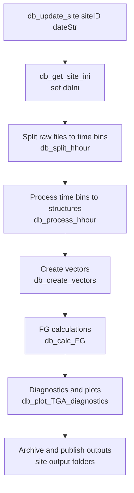

# Flux-Gradient Processing Pipeline

This page documents the **Flux-Gradient (FG)** processing pipeline implemented in the
CWR Lab MATLAB workflow. It focuses on **how the pipeline runs** and **what it produces**.
Site-specific customisation is handled entirely through the site initialization file
(`*_init_all.m`) and is documented separately in **Site Initialization**.

---

## 1. What FG Processing Does

The FG pipeline converts raw FG system data (TGA logger outputs and sonic/SmartFlux
outputs) into:

- **Half-hour structured data** (MATLAB `.mat` structures)
- **Diagnostic vectors** (ASCII / MATLAB vector formats)
- **Flux-gradient calculations** (gradients, eddy diffusivity, fluxes)
- **Diagnostic plots** (TGA diagnostics, QC figures)
- **Archived outputs** (site-year products in standard output folders)

**Supported gases:** N₂O and CO₂

**Output units:**

| Gas | Unit |
|-----|------|
| N₂O flux | ng N₂O-N m⁻² s⁻¹ |
| CO₂ flux | µg CO₂ m⁻² s⁻¹ |

---

## 2. Canonical Entry Points

The typical top-level runner is:

- `db_update_site(siteID, dateStr)` — run one site for a given day (or processing window)

A multi-site automation layer may call:

- `db_update_all(...)` — orchestration across sites and dates
- Windows Task Scheduler → BAT → Python → MATLAB wrappers (see the **Daily Automation** page)

The site adapter file is always loaded first via:

- `db_get_site_ini(siteID, dateStr)` → evaluates `dbIni = <SITEID>_init_all(dateStr)`

---

## 3. Pipeline Stages and Outputs

### 3.1 Split Raw Data → Half-Hour Files

**Purpose:** convert raw logger streams into consistent half-hour chunks aligned to the
time step.

- Primary script: `db_split_hhour`
- Key `dbIni` fields: `hfPth`, `fileType`, `fileExt`, `headerLines`, `delimiter`,
  `outputDur`, `timeStep`

**Output:** half-hour chunk files (location set by site conventions)

---

### 3.2 Process Half-Hours → MATLAB Structures

**Purpose:** parse half-hour chunks into standardised MATLAB structures.

- `db_process_hhour` — main entry point
- `db_process_hhour_sonic` — applies **double coordinate rotation** to align mean wind
  with the $x$-axis before computing turbulent covariances ($u_*$, $\overline{w'T'}$)
- `db_process_hhour_TGA` — processes TGA concentration data; applies tube delay
  correction using `shiftDefault`, discards omit period at level start (10–15 s
  configurable per plot)

**Output:** MATLAB `.mat` structure files under `structures/`

---

### 3.3 Structures → Diagnostic Vectors

**Purpose:** assemble continuous vector time series from per-half-hour structures.

- Primary script: `db_create_vectors`

**Output:** ASCII vectors and MATLAB vector files under `vectors/`

---

### 3.4 Flux-Gradient Calculations

**Purpose:** compute gradients, eddy diffusivity, and fluxes using vector products
and site geometry.

- Wrapper: `db_calc_FG`
- Supporting scripts:
  - `db_calc_grad` — concentration gradients
  - `db_calc_rhoa` — air density ($\rho_a$)
  - `db_calc_K` — eddy diffusivity using the integrated Businger-Dyer formulation
  - `db_get_ENVCAN_clim` — fetches Environment Canada climate data for temperature
    and sensible heat flux gap-filling
  - `db_make_heights` — resolves measurement heights from site geometry

**Key constants applied:**

| Parameter | Value | Source |
|-----------|-------|--------|
| von Kármán constant κ | 0.40 | `Guelph_agromet_constants` |
| Gravity g | 9.81 m s⁻² | Guelph latitude ~43.5 °N |
| Displacement factor | d = 0.67 × h_c | Default; overridable in `dbIni` |
| Roughness length | z₀ = 0.13 × h_c | Site-calibrated default |
| Stability valid range | −5 ≤ ζ ≤ 2 | Outside → K = NaN |
| Stability functions | Businger-Dyer (coefficient 15) | See [FG Fundamentals](fundamentals.md) |

**Gap-filling hierarchy for missing inputs:**

| Input | Primary | Fallback 1 | Fallback 2 |
|-------|---------|------------|------------|
| u\* | Sonic-derived | Adjacent plot (if \|Δh\|/h̄ < 1) | NaN (no flux) |
| Temperature | Sonic virtual temperature (T_v) | ENVCAN climate station | Default 288 K |
| Sensible heat flux H | Sonic-derived | Neutral assumption (ψ_h = 0) | — |

**Output:** calculation tables and products under `calculations/`

---

### 3.5 QC and Filtering

The pipeline applies a hierarchical quality control scheme:

1. Instrument diagnostics (CSAT flags, TGA detector stability)
2. Data completeness — reject if > 50 % NaN in the half-hour
3. Stability range — ζ > 2 or ζ < −5 → K = NaN
4. TGA pressure check — operating range 50–80 mb; ΔP < 0.075 kPa between intakes
5. Outlier count — > 100 outlier samples per half-hour → reject
6. Site-specific filters — wind direction, fetch sectors (defined in `*_init_all.m`)
7. Manual QC — CSV-based filter files for known instrument problems

---

### 3.6 Diagnostics and Plots

- Primary script: `db_plot_TGA_diagnostics(dbIni, fileNames, visibleOff)`
- Generates diagnostic images and figures under the site output tree

---

## 4. Testing a New Site Configuration

Before running a full year, validate in three steps:

1. **Split-only test** — can the pipeline find and split raw files for one day?
2. **Structures test** — can it produce valid half-hour MATLAB structures?
3. **Vectors + FG test** — can it generate vectors and produce at least one day of FG calculations?

If any step fails, review **Site Initialization** (instrument roster, parsing fields,
`outputDur/timeStep`, plot mapping, and TGA manifold timing).

---

## 5. What Is Not Defined Here

Site-specific configuration is handled entirely in:

- **Site Initialization (`*_init_all.m`)** → see: *Flux-Gradient → Site Initialization*
