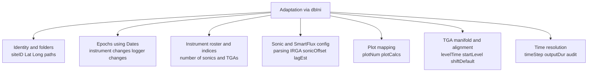

# FG Site Initialization (`*_init_all.m`)

FG processing is designed so that **the MATLAB pipeline is generic** and **site-specific behavior lives entirely in**
a single initialization function:

- `<SITE_ID>_init_all(dateStr)` → returns a `dbIni` structure

The processing pipeline loads this via `db_get_site_ini(siteID, dateStr)` and then uses `dbIni` everywhere downstream.

This page explains **how to adapt the system to a new site** by editing `*_init_all.m`.

---

## 1) Concept: the init file is a site adapter

The init file is **not a static config**. It is a time-dependent function that:

- declares instruments, file formats, and paths
- maps instruments to plots and calculations
- encodes instrument changes over time using epochs
- controls parsing rules for TOA5 and SmartFlux inputs
- controls manifold timing and time alignment for TGA

**Rule of thumb:** if you are onboarding a new site, you should not modify the pipeline scripts first.
Start by making the init file correct.

---

## 2) Adaptation levers

The init files across sites differ along a small number of consistent dimensions. These are the levers a user
must understand.



---

## 3) Required site-level fields (typical)

Most sites define the following top-level fields (names may vary slightly):

- **Identity**
  - `dbIni.siteID`
  - `dbIni.Lat`, `dbIni.Long`
  - `dbIni.plotNum`

- **Paths**
  - `dbIni.dbPth` — site root for raw and working products
  - `dbIni.vecPth` — vectors output folder
  - `dbIni.calcPth` — calculation products folder
  - `dbIni.manPth` — manual measurements folder

- **Optional but common**
  - `dbIni.emailList`
  - profile cups and vanes metadata if used: `cupNum`, `cupPlotID`
  - roughness and displacement defaults: `dHeightRatio`, `z0HeightRatio`, `d_est_bare`, `z0_est_bare`

- **Climate station linkage**
  - `dbIni.ENVCAN_ID` or equivalent

---

## 4) Epochs: configuring changes over time

Most init files declare:

```matlab
Dates(1) = datenum(YYYY,MM,DD,0,0,0);
```

Then instrument definitions are gated:

```matlab
if datenum(dateStr,'yyyymmdd') > Dates(1)
    % define instruments for this epoch
end
```

Use epochs for:
- instrument replacement
- logger program changes
- manifold or intake changes
- major calibration changes requiring different defaults

**Best practice:** keep epochs small and explicit.

---

## 5) Instrument roster and indexing rules

Instruments are stored as:

- `dbIni.Instrument(i)`

Sites typically assign indices like:

- `nSonic_1 = 1`, `nSonic_2 = 2`
- `nTGA_1 = 3`

**Hard rules:**
1. Each index must be unique.
2. Keep a stable ordering: sonics first, TGAs after.
3. Do not re-use an index for a different instrument type in the same epoch.

---

## 6) Sonic and SmartFlux configuration

Sonic-like instruments typically include:

- `Name`, `Type`, `Model`, `SerNum`
- `hfPth`, `strucPth`, `vecPth`, `dbPth`
- `Fs`

Parsing fields:
- `dataOutputs`
- `fileType`
- `fileExt`
- `delimiter`
- `headerLines`
- `tvCol`
- `outputDur`

Processing fields:
- `sonicOffset`
- `IRGA` and `IRGAModel`
- `lagEst`
- `containsMet`

### SmartFlux notes

SmartFlux exports often differ from TOA5 logger outputs:

- time vector may not exist as a tv column
- header structure differs
- output naming differs

**Adaptation guidance**
- confirm header structure and delimiter
- verify file cadence matches `outputDur` relative to `timeStep`
- run a one day smoke test before scaling up

---

## 7) Plot mapping

Plot mapping controls which plots are associated with each sonic.

Key fields:
- `plotNum`
- `Instrument(i).plotCalcs`

Wrong mapping can produce physically wrong results without necessarily throwing an error.

---

## 8) TGA configuration

TGA blocks commonly include:

- parsing fields: `dataOutputs`, `fileType`, `delimiter`, `headerLines`, `tvCol`, `fileExt`, `outputDur`
- manifold and alignment fields:
  - `levelTime`
  - `startLevel`
  - `omit`
  - `lagEst`
  - `shiftDefault`
  - `corrIsotope`

**Operational note:** `shiftDefault` may change over time. Update it using epochs when needed.

---

## 9) Time resolution and outputDur

Many sites use half hourly timeStep 48.

If you switch to hourly timeStep 24, audit every instrument outputDur and re-run the smoke tests.

---

## 10) New site adaptation checklist

Before editing the init file:
- inventory instruments and file formats
- map plot layout
- document manifold timing and intake arrangement

Minimal run tests:
1. split-only test for one day
2. structures test for one day
3. vectors and FG calc test for one day

Full readiness:
- climate station ID set
- manual measurements available
- QC diagnostics reviewed
