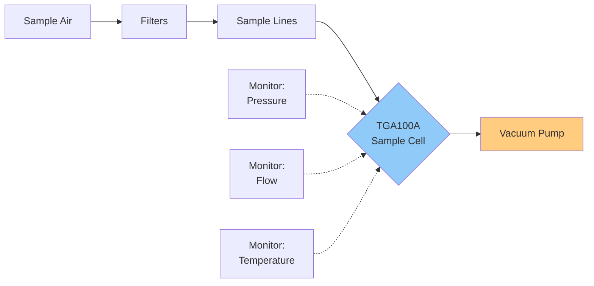
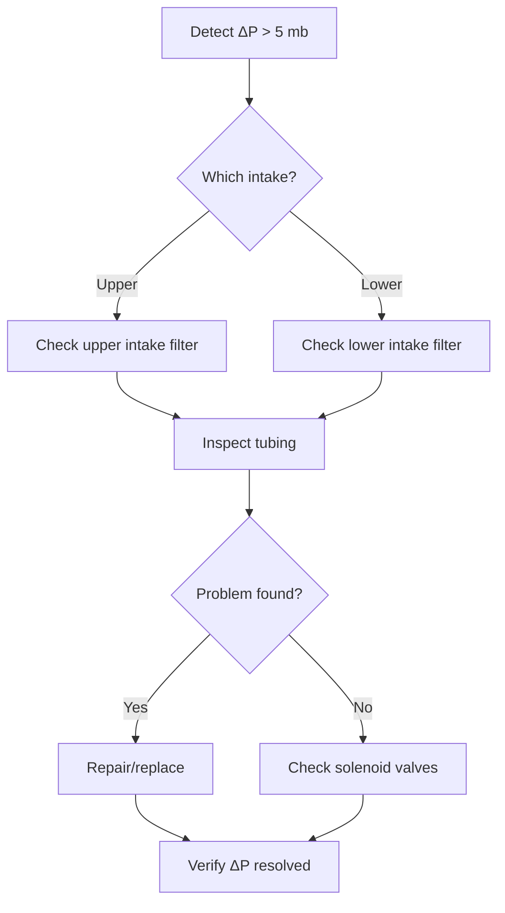

# TGA System Variables

This page documents the diagnostic variables and operational parameters of the
**Campbell Scientific TGA100A Trace Gas Analyzer**, which forms the core of the
flux-gradient measurement system at ON1.

!!! info "Variable Context"
    All TGA variables are computed at **30-minute intervals** from high-frequency (10 Hz)
    measurements. These diagnostic parameters monitor system health and data quality.

---

## Overview: TGA100A Operation

The TGA100A uses **tunable diode laser absorption spectroscopy** to measure N₂O and CO₂
concentrations in a temperature- and pressure-controlled sample cell.

### Key Specifications

| Parameter | Value |
|-----------|-------|
| Target gases | N₂O and CO₂ |
| Measurement frequency | 10 Hz |
| Sample cell path length | 153.08 cm |
| Operating pressure | 50–80 mb |
| Sample flow range | 500–2000 ml/min |
| Cooling system | Liquid nitrogen (LN₂) |
| Precision (N₂O) | < 0.3 ppb |
| Precision (CO₂) | < 0.1 ppm |

---

## Measurement Cycle

### Level Timing

The TGA cycles through intakes sequentially. Each level receives **60 seconds** of sampling,
and an initial **omit period of 10–15 seconds** (configurable per plot in `*_init_all.m`)
is discarded to allow the sample line to flush after a valve switch.

| Stage | Duration | Notes |
|-------|----------|-------|
| Reference gas (zero) | 30 s | Baseline zero measurement |
| Per-level sampling | 60 s | Valid window after omit period |
| Omit period (start of level) | 10–15 s (configurable) | Flush time — discarded |
| Minimum valid level | ≥ 12 s | Below this, half-hour is rejected |

With a 4-plot system, **one complete cycle** (reference + 4 plots × 2 heights + reference)
takes approximately 10 minutes, giving ~3 measurements per plot per 30-minute period.

!!! note "Temporal coverage"
    Each plot receives roughly **1 flux estimate per 2 hours** in a 4-plot cycle
    (since each full cycle covers all plots, and fluxes are averaged over the 30-minute window).

### Tube Delay

The pipeline estimates tube delay using **sine-curve fitting to the CO₂ signal** during the
nighttime window (20:30–07:30 local time). The estimated delay is stored in the init file and
applied during structure processing.

| Parameter | Value |
|-----------|-------|
| Estimation method | Sine-curve fitting to CO₂ signal |
| Time window | Nighttime (20:30–07:30) |
| Typical delay (TGA100A) | 2–6 seconds |
| Override mechanism | Override file for corrections |

The `shiftDefault` parameter in `*_init_all.m` holds the current best estimate; it should be
reviewed and updated when plumbing is modified or when new lag estimates become available.

### Zero and Negative Concentrations

Any zero or negative concentration readings are **converted to NaN** before further processing.
These represent non-physical values caused by electrical noise, ADC saturation, or sample
cell contamination.

---

## Pressure Variables

### Sample Pressure

**Units:** mb (millibars)

The pressure inside the TGA sample cell directly controls measurement accuracy:
it determines the molecular number density along the laser absorption path.

**Operating range:** 50–80 mb

**Quality control requirements:**

- Record daily and compare to 7-day moving average
- Flag if deviation > 10 % from baseline
- Investigate immediately if declining trend indicates filter clogging
- Check pump performance if sample pressure drops below 50 mb

!!! danger "Critical Parameter"
    Sample pressure directly affects measurement accuracy. Variations > 5 mb from
    typical operation should be investigated immediately.

**QA/QC Thresholds:**

| Parameter | Min | Max | Flag Action |
|-----------|-----|-----|-------------|
| Sample Pressure | 50 mb | 80 mb | Check pump, filters, or plumbing |
| Acceptable operating range | 300 mb | 400 mb (30–40 kPa) | Flag if outside range |

---

### Delta Sample Pressure

**Units:** mb (millibars)

Pressure difference between the upper and lower intakes in the multi-plot configuration.

**Acceptable range:** < 5 mb (< 0.075 kPa for each switching event)

Large ΔP between intakes indicates a flow imbalance that biases residence times and can
affect gradient measurements.

!!! failure "Red Flag"
    ΔP > 5 mb between intakes indicates:
    - Blockage in one sampling line
    - Filter clogging at a specific intake
    - Bent or kinked tubing
    - Insect or debris in intake

**Troubleshooting Workflow:**

---

### TGA Pressure

**Units:** mb (millibars)

Operating pressure inside the analyzer body (separate from sample cell pressure in some
configurations). Must remain stable for consistent laser alignment and absorption.

**Typical range:** 50–80 mb

---

### Bypass Pressure

**Units:** mb (millibars)

Pressure in the bypass line of the multi-intake sampling system. The bypass maintains
constant pressure while allowing sequential sampling from different intakes.

Sudden changes in bypass pressure indicate:

- Leak in sampling system
- Blocked intake line
- Pump malfunction
- Solenoid valve failure

---

## Flow Variables

### Sample Flow

**Units:** ml min⁻¹

Flow rate of air through the TGA sample cell.

**Operating range:** 500–2000 ml min⁻¹ (site-specific optimum)

The flow rate is adjusted to achieve ~90 % laser transmittance — the balance between
fresh sample replenishment and adequate absorption signal.

**Quality control:**

- Monitor for gradual decline (filter plugging — typical 10 % over 2–4 weeks)
- Investigate sudden drops immediately (leak or pump failure)
- Flag if flow changes > 5 % between consecutive 30-minute periods

---

### Delta Sample Flow

**Units:** ml min⁻¹

Difference in flow rates between the upper and lower intakes.

Equal flow rates ensure comparable residence times, identical moisture conditioning,
and unbiased concentration comparisons between intake heights. Persistent imbalance
should be corrected by checking filters, verifying equal line lengths, or adding
flow restrictors.

---

## Quality Control: Outlier Threshold

The pipeline counts the number of 10 Hz samples flagged as outliers within each
30-minute period. If more than **100 outlier samples** are present in a half-hour,
the entire half-hour is rejected.

---

## Daily Monitoring Checklist

### Morning System Check (5 minutes)

- [ ] Record sample pressure: _____ mb
- [ ] Record sample flow: _____ ml min⁻¹
- [ ] Check ΔP between intakes: _____ mb
- [ ] Verify LN₂ level sufficient
- [ ] Review overnight data flags
- [ ] Check calibration gas pressure

### End-of-Day Review (10 minutes)

- [ ] Calculate daily mean pressure: _____ mb
- [ ] Compare to 7-day baseline: _____ %
- [ ] Review flagged periods
- [ ] Update maintenance log
- [ ] Download data backup

---

## Monitoring Dashboard

  <iframe src="https://www.youtube.com/embed/placeholder" frameborder="0" allowfullscreen></iframe>

📹 Video demonstration — see online documentation — available in the online documentation at the project site.

*Interactive dashboard: Real-time TGA system diagnostics*

---

## Reference Material

For complete TGA100A specifications and troubleshooting procedures, refer to:

- [Campbell TGA100A Manual](../../Campbell_TGA_Manual.pdf) — Section 7.1.2 (Routine System Checks)
- Site-specific calibration protocols
- CWR Lab standard operating protocols and procedures

---

## Next Steps

- [FG Fundamentals](fundamentals.md) — Theory and flux equations
- [Processing Pipeline](processing-pipeline.md) — MATLAB script workflow
- [Troubleshooting](troubleshooting.md) — Common issues and solutions
