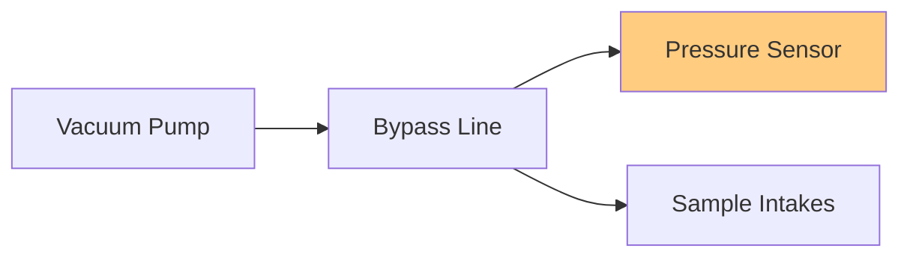
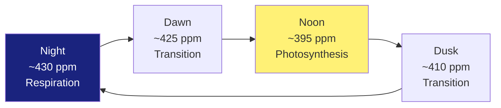

# Complete Variable Glossary

This glossary provides comprehensive definitions for all diagnostic variables measured at the ON1 site. Variables are organized by measurement system.

!!! info "Usage Notes"
    - All variables computed at 30-minute intervals
    - Typical ranges are site-specific
    - Establish baselines during commissioning
    - Cross-reference with instrument manuals

---

## Quick Navigation

- [Flux-Gradient Variables](#flux-gradient-system-variables)
    - [TGA Pressures](#tga-pressures)
    - [TGA Flows](#tga-flows)
    - [TGA Temperatures](#tga-temperatures)
    - [Concentrations](#gas-concentrations)
- [Eddy Covariance Variables](#eddy-covariance-system-variables)
    - [Wind Components](#wind-components)
    - [Fluxes](#turbulent-fluxes)
    - [Statistics](#turbulent-statistics)
- [Shared Variables](#shared-meteorological-variables)

---

## Flux-Gradient System Variables

### TGA Pressures

#### Bypass Pressure

| | |
|---|---|
| **Symbol** | P_bypass |
| **Units** | mb (millibars) |
| **Definition** | Pressure in the bypass line of the TGA sampling system |
| **Purpose** | Monitors pressure control in the multi-intake sampling system |
| **Typical Range** | Site-specific; depends on pump capacity and flow rates |

**Quality Control**:
- Should remain stable during operation
- Changes indicate plumbing problems or leaks
- Monitor for drift over time

#### Sample Pressure

| | |
|---|---|
| **Symbol** | P_sample |
| **Units** | mb (millibars) |
| **Definition** | Pressure in the TGA sample cell during measurement |
| **Purpose** | Critical for accurate concentration calculations; used in gas density conversions |
| **Typical Range** | 40-100 mb (controlled by vacuum pump) |

!!! danger "Critical Parameter"
    Sample pressure directly affects measurement accuracy. Changes > 5 mb from typical operation require immediate investigation.

**Quality Control**:
- Record **daily** and compare to historical values
- Changes indicate problems with flows/pressures in sampling system
- Will decrease over time as filters become plugged

**Daily Monitoring Protocol**:
1. Record at start of day
2. Compare to 7-day moving average
3. Flag if deviation > 10%
4. Investigate declining trends

---

### TGA Flows

#### Sample Flow

| | |
|---|---|
| **Symbol** | Q_sample |
| **Units** | ml/min (milliliters per minute) |
| **Definition** | Flow rate of air through the TGA sample cell |
| **Purpose** | Determines residence time and affects measurement precision |
| **Typical Range** | 500-2000 ml/min (site-specific) |

**Flow-Pressure Optimization**:

The optimal flow rate balances:
- Higher flow → Fresh sample, reduced memory effects
- Lower flow → Better signal-to-noise, more absorption
- Target: ~90% laser transmittance

---

### Gas Concentrations

#### N₂O Concentration

| | |
|---|---|
| **Symbol** | [N₂O] |
| **Units** | ppb (parts per billion) |
| **Definition** | Nitrous oxide mole fraction in air sample |
| **Purpose** | Primary measurement for N₂O flux calculations |
| **Typical Range** | 320-350 ppb background; higher over agricultural soils |

**Agricultural Context**:
- Background atmospheric: ~333 ppb
- Enhanced by: Fertilizer application, soil disturbance
- Temporal patterns: Episodic emissions, freeze-thaw events

#### CO₂ Concentration

| | |
|---|---|
| **Symbol** | [CO₂] |
| **Units** | ppm (parts per million) |
| **Definition** | Carbon dioxide mole fraction in air sample |
| **Purpose** | For CO₂ flux calculations, comparison with EC system |
| **Typical Range** | 400-450 ppm depending on time of day and season |

**Diurnal Pattern**:

---

## Eddy Covariance System Variables

### Wind Components

#### u - Longitudinal Wind

| | |
|---|---|
| **Symbol** | u, u' |
| **Units** | m/s |
| **Definition** | Horizontal wind component aligned with mean wind direction |
| **Typical Range** | -5 to +15 m/s (mean), ±5 m/s (fluctuations) |

#### v - Lateral Wind

| | |
|---|---|
| **Symbol** | v, v' |
| **Units** | m/s |
| **Definition** | Horizontal wind component perpendicular to mean wind |
| **Typical Range** | Near 0 m/s (mean after rotation), ±3 m/s (fluctuations) |

#### w - Vertical Wind

| | |
|---|---|
| **Symbol** | w, w' |
| **Units** | m/s |
| **Definition** | Vertical wind component |
| **Typical Range** | ~0 m/s (mean after rotation), ±2 m/s (fluctuations) |

!!! note "Coordinate Rotation"
    After proper coordinate rotation:
    - $\overline{v} \approx 0$
    - $\overline{w} \approx 0$
    - Only $\overline{u}$ should be non-zero

---

### Turbulent Fluxes

#### CO₂ Flux

| | |
|---|---|
| **Symbol** | F_CO₂ or F_c |
| **Units** | μmol/m²/s |
| **Definition** | Vertical turbulent flux of CO₂ |
| **Calculation** | $F_{CO_2} = \overline{w'c'}$ |
| **Typical Range** | -30 to +15 μmol/m²/s |

**Sign Convention**:
- **Negative**: Downward flux (uptake by vegetation)
- **Positive**: Upward flux (respiration)

**Typical Daily Pattern**:

| Time | Typical Flux | Process |
|------|-------------|---------|
| 06:00 | +5 μmol/m²/s | Early respiration |
| 12:00 | -20 μmol/m²/s | Peak photosynthesis |
| 18:00 | -5 μmol/m²/s | Declining uptake |
| 24:00 | +10 μmol/m²/s | Nighttime respiration |

#### Sensible Heat Flux

| | |
|---|---|
| **Symbol** | H |
| **Units** | W/m² |
| **Definition** | Vertical turbulent flux of sensible heat |
| **Calculation** | $H = \rho c_p \overline{w'T'}$ |
| **Typical Range** | -50 to +400 W/m² |

Where:
- $\rho$ = air density (kg/m³)
- $c_p$ = specific heat of air (1005 J/kg/K)
- $T$ = air temperature (K)

#### Latent Heat Flux

| | |
|---|---|
| **Symbol** | LE or λE |
| **Units** | W/m² |
| **Definition** | Vertical turbulent flux of latent heat (evapotranspiration) |
| **Calculation** | $LE = \lambda \overline{w'\rho_v'}$ |
| **Typical Range** | 0 to +500 W/m² |

Where:
- $\lambda$ = latent heat of vaporization (2.45 MJ/kg)
- $\rho_v$ = water vapor density (g/m³)

---

### Turbulent Statistics

#### Friction Velocity

| | |
|---|---|
| **Symbol** | u* |
| **Units** | m/s |
| **Definition** | Measure of turbulent intensity in surface layer |
| **Calculation** | $u_* = \left[(\overline{u'w'})^2 + (\overline{v'w'})^2\right]^{1/4}$ |
| **Typical Range** | 0.1 to 1.0 m/s |

**Importance**:
- Characterizes turbulent mixing
- Critical for flux-gradient calculations
- Quality control parameter (u* threshold)
- Footprint calculations

**Quality Threshold**:
- Nighttime fluxes typically filtered when $u_* < 0.1$ m/s (site-specific)

#### Obukhov Length

| | |
|---|---|
| **Symbol** | L |
| **Units** | m |
| **Definition** | Characteristic length scale of atmospheric stability |
| **Calculation** | $L = -\frac{u_*^3 \overline{T}}{\kappa g \overline{w'T'}}$ |
| **Typical Range** | -∞ to +∞ |

**Interpretation**:

| L Value | Stability | Typical Time | Mixing |
|---------|-----------|--------------|--------|
| L < 0 | Unstable | Daytime | Enhanced |
| L → ±∞ | Neutral | Cloudy/Windy | Moderate |
| L > 0 | Stable | Nighttime | Suppressed |

---

## Shared Meteorological Variables

### Temperature

#### Air Temperature

| | |
|---|---|
| **Symbol** | T_air |
| **Units** | °C or K |
| **Definition** | Ambient air temperature at measurement height |
| **Measurement** | Thermistor or thermocouple in aspirated shield |

#### Sonic Temperature

| | |
|---|---|
| **Symbol** | T_sonic or T_s |
| **Units** | °C or K |
| **Definition** | Temperature derived from sonic anemometer (speed of sound) |
| **Relationship** | $T_s = T(1 + 0.51q)$ where q is specific humidity |

!!! note "Virtual Temperature"
    Sonic temperature includes moisture effects and must be corrected to obtain actual air temperature.

### Humidity

#### Relative Humidity

| | |
|---|---|
| **Symbol** | RH |
| **Units** | % |
| **Definition** | Ratio of actual to saturation vapor pressure |
| **Typical Range** | 20-100% |

#### Specific Humidity

| | |
|---|---|
| **Symbol** | q |
| **Units** | g/kg |
| **Definition** | Mass of water vapor per mass of moist air |
| **Calculation** | $q = 0.622 \frac{e}{P-0.378e}$ |

Where:
- $e$ = vapor pressure (Pa)
- $P$ = total pressure (Pa)

### Radiation

#### Net Radiation

| | |
|---|---|
| **Symbol** | R_n |
| **Units** | W/m² |
| **Definition** | Net radiative flux at surface |
| **Calculation** | $R_n = SW_{in} - SW_{out} + LW_{in} - LW_{out}$ |

Components:
- SW_in: Incoming shortwave
- SW_out: Reflected shortwave
- LW_in: Incoming longwave
- LW_out: Outgoing longwave

---

## Using This Glossary

### For New Users

1. **Start with basics**: Understand main flux variables first
2. **Learn QA/QC**: Focus on quality control parameters
3. **Cross-reference**: Use with method chapters for context

### For Data Analysis

1. **Variable selection**: Choose appropriate variables for analysis
2. **Units**: Verify unit consistency
3. **Quality flags**: Apply appropriate filtering
4. **Typical ranges**: Use to identify outliers

### For Troubleshooting

1. **Check diagnostics**: Start with pressure/flow variables
2. **Compare typical ranges**: Identify deviations
3. **Time series analysis**: Look for trends
4. **Cross-validation**: Compare FG and EC when available

---

## Measurement Schedule

| Variable Type | Measurement Frequency | Output Interval |
|--------------|---------------------|-----------------|
| TGA diagnostics | 10 Hz | 30 minutes |
| EC raw data | 10 Hz | Stored as 10 Hz |
| EC fluxes | Computed from 10 Hz | 30 minutes |
| Meteorology | 1 Hz or slower | 30 minutes |

---

## References

For complete details on variables and measurement principles:

- **Introduction**: [Site Overview](introduction/overview.md)
- **EC Variables**: [EC Variables Guide](eddy-covariance/variables.md)
- **FG Variables**: [FG Variables Guide](flux-gradient/variables.md)
- **TGA System**: [TGA System Details](flux-gradient/tga-system.md)
- **References**: [Scientific Literature](references.md)

---

*This glossary is based on the ON1 Variables Glossary Documentation (Version 1.0, December 2025)*
