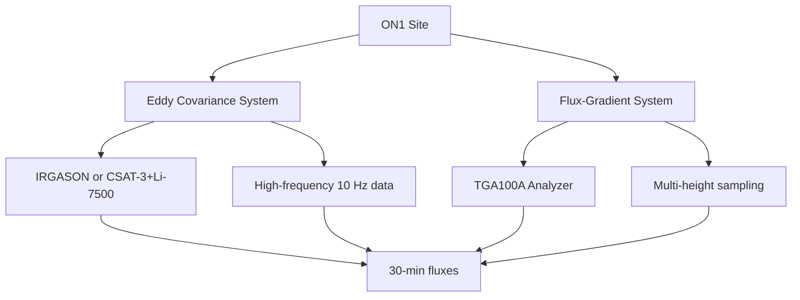

# Overview

Welcome to the CWR Lab micrometeorological measurement and analysis documentation. This resource is designed for new students, researchers, and staff working with CO2 and N2O flux measurement systems.

## Measurement Sites

CWR Lab agrometeorology network include long-term benchmark sites and field towers across Canada. These sites span diverse climates and soil types from Ontario’s humid croplands to the prairie provinces’ dry continental systems, and support side-by-side comparisons of fertilizer practices, crop rotations, cover crops, and inhibitors. Each benchmark site combines continuous micrometeorological flux measurements with soil process studies, providing region-specific insights into nitrous oxide dynamics and the effectiveness of best management practices. Together, these sites form the foundation for scaling farm-level results into national strategies for emission reduction.

All network sites employ two complementary micrometeorological measurement techniques for quantifyin greenhouse gas and energy fluxes:

1. **Flux-Gradient (FG) Method** - Uses vertical concentration gradients
2. **Eddy Covariance (EC) Method** - Direct turbulent flux measurements

## Quick Navigation

-   :material-book-open-variant:{ .lg .middle } __Introduction__

    ---

    About the ON1 site, instrumentation, and measurement principles

    [:octicons-arrow-right-24: Get started](introduction/overview.md)

-   :material-weather-windy:{ .lg .middle } __Eddy-Covariance__

    ---

    Direct turbulent flux measurements with high-frequency data

    [:octicons-arrow-right-24: Learn EC](eddy-covariance/fundamentals.md)

-   :material-gradient-vertical:{ .lg .middle } __Flux-Gradient__

    ---

    Gradient-based flux estimation using MOST theory

    [:octicons-arrow-right-24: Learn FG](flux-gradient/fundamentals.md)

-   :material-book-alphabet:{ .lg .middle } __Glossary__

    ---

    Complete variable definitions and diagnostic parameters

    [:octicons-arrow-right-24: View glossary](glossary.md)

## Key Features

- **30-minute averaging intervals** for all diagnostic variables
- **High-frequency measurements** at 10 Hz (EC system)
- **Dual-method comparison** for data validation
- **Comprehensive QA/QC guidelines**

## Getting Started

!!! tip "New Users Start Here"
    1. Read the [Site Overview](introduction/overview.md) to understand the measurement setup
    2. Review the [Instrumentation](introduction/instrumentation.md) section
    3. Choose measurement method: [EC](eddy-covariance/fundamentals.md) or [FG](flux-gradient/fundamentals.md)
    4. Familiarize with [Quality Control](eddy-covariance/quality-control.md) procedures

## Video Tutorial

Below is an introductory video explaining the site setup (example of video embedding):

<!-- Replace with actual video URL -->

  <video id="tutorialVideo"
         controls
         style="position: absolute; top: 0; left: 0; width: 100%; height: 100%;">
  </video>

## Site Diagram

## Recent Updates

| Date | Update |
|------|--------|
| Dec 2025 | Initial documentation compiled from instrument manuals |
| TBD | Site-specific calibration values |
| TBD | Measurement heights and footprint analysis |

---

!!! warning "Important Note"
    The EC system at ON1 can be configured with either an **IRGASON** (integrated sensor) or separate **CSAT-3 + Li-7500** instruments. [PS: Verify the current configuration]
