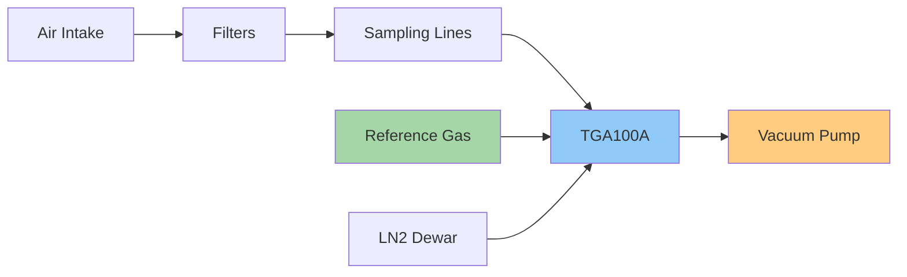
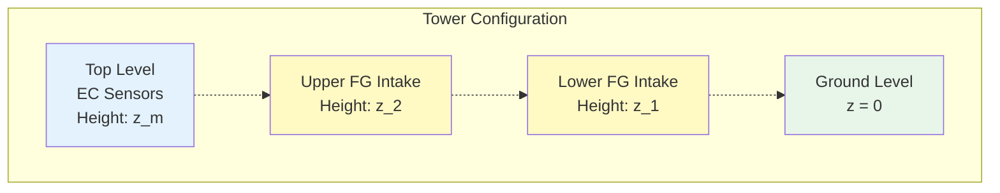

# Instrumentation

## System Overview

The ON1 site utilizes state-of-the-art micrometeorological instruments from Campbell Scientific and LI-COR Biosciences to measure greenhouse gas and energy fluxes.

## Flux-Gradient System

### Primary Instrument: TGA100A Trace Gas Analyzer

{ align=right width="400" }

The Campbell Scientific TGA100A is the heart of the flux-gradient measurement system.

#### Technology
- **Measurement principle**: Tunable diode laser absorption spectroscopy
- **Measurement frequency**: 10 Hz
- **Target gases**: N₂O and CO₂
- **Path length**: 153.08 cm (sample cell)
- **Cooling system**: Liquid nitrogen (LN₂) for laser stabilization

#### Measurement Approach
Multi-plot flux-gradient using dual-ramp absorption spectroscopy enables precise concentration measurements at multiple sampling heights.

!!! info "TGA100A Specifications"
    | Parameter | Specification |
    |-----------|--------------|
    | Sample cell path | 153.08 cm |
    | Operating pressure | 50-80 mb |
    | Sample flow | 500-2000 ml/min |
    | Measurement frequency | 10 Hz |
    | Precision (N₂O) | < 0.3 ppb |
    | Precision (CO₂) | < 0.1 ppm |

### Supporting Components

The TGA system requires several supporting components for proper operation:

- **Sampling system**: Multi-height intake with automated switching
- **Vacuum pump**: Maintains controlled sample pressure
- **Reference gas supply**: For calibration and drift correction
- **Temperature and pressure sensors**: For gas density corrections
- **Automated calibration system**: Periodic zero and span checks

## Eddy Covariance System

The ON1 site can be configured with one of two EC system setups. Verify the current configuration.

### Configuration 1: IRGASON

{ align=right width="300" }

**Integrated CO₂/H₂O Open-Path Gas Analyzer and 3-D Sonic Anemometer**

The IRGASON combines gas analysis and wind measurement in a single, co-located instrument, minimizing flux loss from sensor separation.

#### Specifications

| Parameter | Value |
|-----------|-------|
| Manufacturer | Campbell Scientific |
| Maximum measurement rate | 60 Hz |
| User-programmable output | 5, 10, 12.5, or 20 Hz |
| Gas analyzer path length | 15.37 cm |
| CO₂ calibrated range | 0-1000 μmol/mol |
| H₂O calibrated range | 0-72 mmol/mol |

#### Advantages
- Co-located measurements reduce flux loss
- Simplified installation
- Single power supply and data connection
- Integrated heating for cold weather operation

### Configuration 2: CSAT-3 + Li-7500

#### Component A: CSAT-3 Sonic Anemometer

{ align=right width="250" }

**Three-Dimensional Sonic Anemometer**

Measures wind velocity components and sonic temperature at high frequency.

**Key Specifications:**

- **Manufacturer**: Campbell Scientific
- **Measurement frequency**: 60 Hz (typical operation at 10 or 20 Hz)
- **Measured variables**: 
    - 3-D wind components (Ux, Uy, Uz)
    - Sonic temperature (Ts)
- **Wind offset specification**: 
    - Horizontal: < ±8.0 cm/s
    - Vertical: < ±4.0 cm/s

!!! note "Coordinate System"
    The CSAT-3 measures wind in its own coordinate system, which requires rotation to align with mean wind direction (coordinate rotation is part of standard EC processing).

#### Component B: Li-7500 Open-Path Analyzer

{ align=right width="250" }

**Open-Path CO₂/H₂O Gas Analyzer**

Measures CO₂ and H₂O concentrations using infrared absorption.

**Key Specifications:**

- **Manufacturer**: LI-COR Biosciences
- **Measurement bandwidth**: 5, 10, or 20 Hz (software selectable)
- **Path length**: 12.5 cm
- **Precision (RMS)**: 
    - CO₂: 0.2 mg/m³
    - H₂O: 0.004 g/m³

!!! warning "Open-Path Considerations"
    Open-path analyzers are affected by:
    
    - Rain and fog (contamination)
    - Temperature fluctuations (WPL corrections required)
    - Dust and debris accumulation
    
    Regular cleaning and maintenance are essential.

## Sensor Placement and Geometry

### Typical Heights (Site-Specific)

!!! example "Example Configuration"
    | Level | Height (m) | Measurement |
    |-------|-----------|-------------|
    | EC sensors | 3.0 | Direct fluxes |
    | FG upper intake | 2.5 | Concentration C₂ |
    | FG lower intake | 0.5 | Concentration C₁ |
    | Canopy height | 0.3 | Reference level |

## Maintenance Schedule

### Daily Checks
- [ ] TGA sample pressure and flow
- [ ] EC data quality flags
- [ ] Visual inspection of sensors
- [ ] Check data logger connection

### Weekly Checks
- [ ] Clean EC sensor windows
- [ ] Check TGA LN₂ level
- [ ] Inspect sampling lines for leaks
- [ ] Review data quality metrics

### Monthly Checks
- [ ] Full system calibration
- [ ] Replace inlet filters
- [ ] Check all electrical connections
- [ ] Backup data and logs

### Quarterly Maintenance
- [ ] Professional calibration service
- [ ] Replace consumables
- [ ] Detailed performance review
- [ ] Update site documentation

## Instrument Manuals

All detailed instrument manuals are available in the project files:

- [Campbell TGA100A Manual](../../Campbell_TGA_Manual.pdf){ .md-button }
- [Campbell CSAT-3 Manual](../../Campbell_CSAT3_Manual.pdf){ .md-button }
- [LI-COR Li-7500 Manual](../../LICOR_Li7500_open_path_CO2_analyzer_manual.pdf){ .md-button }

!!! tip "Quick Reference"
    Bookmark the following manual sections for quick access:
    
    - **TGA100A**: Section 7.1.2 (Routine System Checks)
    - **CSAT-3**: Section 11.2.2 (Wind Offset Testing)
    - **Li-7500**: Section 5 (Maintenance)

## Video Demonstrations

### TGA System Setup

  <iframe src="https://www.youtube.com/embed/placeholder" frameborder="0" allowfullscreen></iframe>

📹 Video demonstration — see online documentation — available in the online documentation at the project site.

*Video: TGA100A setup and calibration procedure (20 minutes)*

### EC Sensor Installation

  <iframe src="https://www.youtube.com/embed/placeholder" frameborder="0" allowfullscreen></iframe>

📹 Video demonstration — see online documentation — available in the online documentation at the project site.

*Video: EC sensor mounting and alignment (15 minutes)*

---

## Next Steps

Now that you understand the instrumentation, proceed to learn about the specific measurement methods:

- [Eddy-Covariance Fundamentals](../eddy-covariance/fundamentals.md)
- [Flux-Gradient Fundamentals](../flux-gradient/fundamentals.md)
