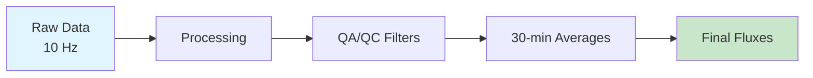
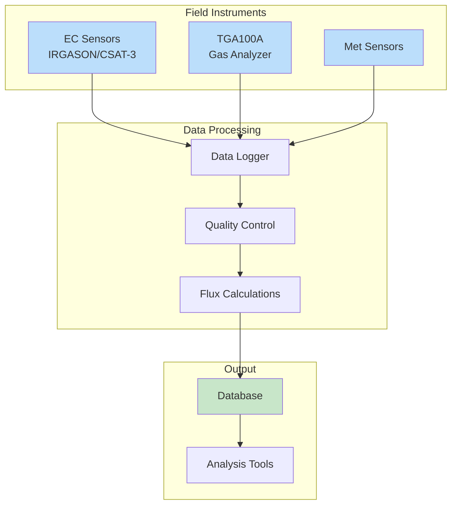

# Overview

## Site Overview

The main long-term site at Elora, Ontario (ON1) employs two complementary micrometeorological measurement techniques for quantifying greenhouse gas and energy fluxes. Understanding both methods allows for cross-validation and comprehensive flux characterization.

#### 1. Flux-Gradient (FG) Method
The flux-gradient method uses **vertical concentration gradients** to estimate fluxes. This semi-empirical approach requires parameterization of turbulent exchange through eddy diffusivity.

**Key characteristics:**

- Measures concentration differences at multiple heights
- Applies Monin-Obukhov Similarity Theory (MOST)
- More compact footprint than EC
- Better suited for heterogeneous surfaces
- Requires stable atmospheric conditions

#### 2. Eddy Covariance (EC) Method
The eddy covariance method provides **direct turbulent flux measurements** by correlating high-frequency fluctuations in wind and scalar concentrations.

**Key characteristics:**

- Direct flux measurement (no assumptions about turbulent transfer)
- High-frequency data collection (10 Hz)
- Widely accepted as standard method
- Larger spatial footprint
- Works in various stability conditions

## Why Two Methods?

!!! note "Complementary Approaches"
    Using both FG and EC methods provides:
    
    - **Validation**: Agreement within 20-30% indicates well-functioning systems
    - **Redundancy**: Backup measurements if one system fails
    - **Different footprints**: Better spatial coverage
    - **Method comparison**: Research and method development opportunities

## Data Collection

All diagnostic variables are computed at **30-minute intervals** from high-frequency raw measurements.

## Measurement Frequency

| System | Raw Frequency | Output Interval | Variables |
|--------|--------------|-----------------|-----------|
| EC System | 10 Hz | 30 minutes | CO₂, H₂O, momentum, heat |
| FG System | 10 Hz | 30 minutes | N₂O, CO₂, gradients |

## Site Photographs

<!-- Example of how to include images -->
{ width="600" }
*Figure 1: ON1 tower showing instrument placement*

{ width="300" }
*EC sensor configuration*

{ width="300" }
*TGA100A analyzer system*

## Data Flow Diagram

## Timeline and Workflow

For new users, we recommend the following workflow:

1. **Week 1**: Read all documentation and instrument manuals
2. **Week 2**: Shadow experienced user during site visit
3. **Week 3**: Perform supervised data collection
4. **Week 4+**: Independent operation with periodic check-ins

## Key Contacts

!!! info "Getting Help"
    - **Site Manager**: [Contact details]
    - **Lab Supervisor**: [Contact details]
    - **Technical Support**: [Contact details]
    - **Emergency Contact**: [Contact details]

## Next Steps

Continue to the detailed [Site Description](site-description.md) to learn about the physical setup and environmental context.

---

## Video: Introduction to Flux Measurement

<!-- Example: Embedded local video -->

  <video width="100%" controls>
    <source src="../videos/flux-intro.mp4" type="video/mp4">
    Your browser does not support the video tag.
  </video>

📹 Video: Basic principles of flux measurements (15 min) — available in the online documentation at the project site.

*Video 1: Basic principles of flux measurements (15 minutes)*
