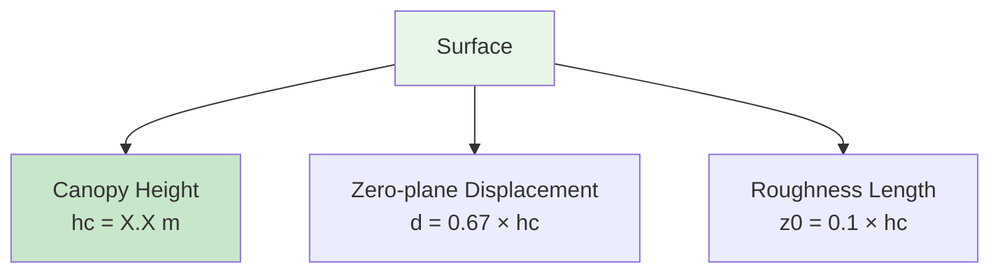
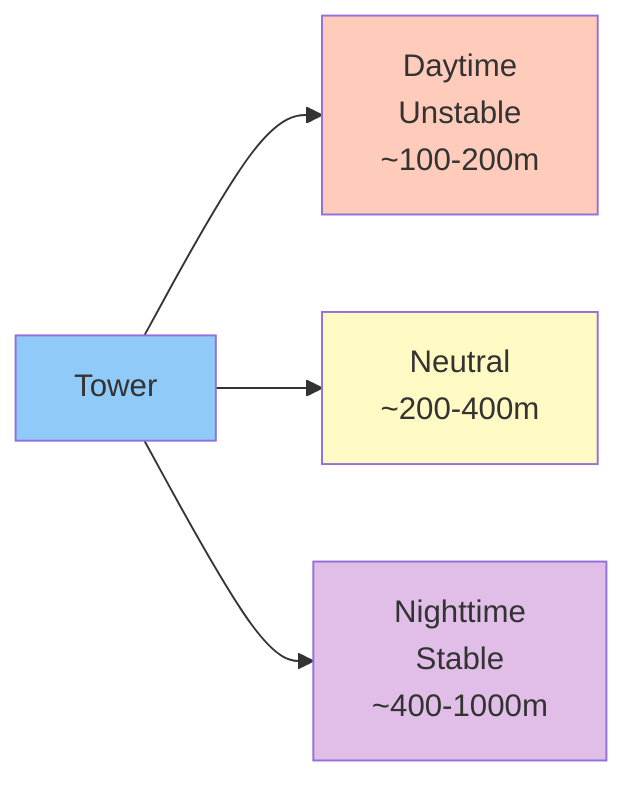

# Site Description

## Location and Setting

!!! info "Site Coordinates"
    - **Site Code**: ON1
    - **Location**: [To be added]
    - **Coordinates**: [Latitude, Longitude]
    - **Elevation**: [meters above sea level]
    - **Time Zone**: [Local time zone]

## Land Use and Vegetation

### Current Land Use
[Description of current agricultural or natural land use at the site]

### Vegetation Characteristics

| Parameter | Value/Description |
|-----------|------------------|
| Dominant species | [List main plant species] |
| Canopy height (hc) | [meters] |
| Leaf Area Index (LAI) | [m²/m²] |
| Growing season | [Months/dates] |
| Management | [Tillage, fertilization, irrigation] |

### Seasonal Variation

=== "Spring"
    - Crop emergence
    - Typical canopy height: [height]
    - LAI development stage
    
=== "Summer"
    - Peak growth period
    - Maximum canopy height: [height]
    - Maximum LAI: [value]
    
=== "Fall"
    - Harvest period
    - Senescence stage
    - Crop residue management
    
=== "Winter"
    - Bare soil or cover crop
    - Minimal vegetation
    - Potential snow cover

## Climate

### Annual Climate Summary

| Parameter | Value | Notes |
|-----------|-------|-------|
| Mean annual temperature | [°C] | |
| Mean annual precipitation | [mm] | |
| Growing degree days | [GDD] | Base 5°C |
| Frost-free period | [days] | |
| Prevailing wind direction | [direction] | |

### Climate Normals (1991-2020)

*Figure: Monthly temperature and precipitation normals*

## Soil Characteristics

### Soil Type and Classification

- **Soil Order**: [Classification]
- **Texture**: [Clay/Loam/Sand percentages]
- **Drainage**: [Well/Moderately/Poorly drained]
- **pH**: [value]
- **Organic matter content**: [%]

### Soil Profile

| Horizon | Depth (cm) | Description |
|---------|-----------|-------------|
| A | 0-20 | [Description] |
| B | 20-60 | [Description] |
| C | 60+ | [Description] |

## Tower Configuration

### Measurement Heights

*Figure: Vertical profile of instrumentation*

| Instrument/Sensor | Height (m) | Purpose |
|------------------|-----------|---------|
| EC sensors (IRGASON/CSAT-3) | [height] | Turbulent fluxes |
| FG upper intake | [height] | Concentration C₂ |
| FG lower intake | [height] | Concentration C₁ |
| Air temperature | [heights] | Profile measurements |
| Wind speed | [heights] | Profile measurements |

### Surface Roughness Parameters

| Parameter | Symbol | Value | Notes |
|-----------|--------|-------|-------|
| Canopy height | hc | [m] | Seasonal variation |
| Displacement height | d | [m] | ~0.67 × hc |
| Roughness length | z₀ | [m] | ~0.1 × hc |
| Measurement height | zm | [m] | EC sensors |

## Flux Footprint

### Typical Footprint Characteristics

The spatial area contributing to flux measurements varies with:

- **Atmospheric stability**: Larger under stable, smaller under unstable
- **Wind speed**: Scales with mean wind
- **Measurement height**: Linear scaling
- **Surface roughness**: Affects near-field contribution

### Footprint Analysis

**Typical footprint distances:**

| Condition | Peak contribution | 80% cumulative | 90% cumulative |
|-----------|------------------|----------------|----------------|
| Unstable | ~50m | ~150m | ~300m |
| Neutral | ~100m | ~300m | ~600m |
| Stable | ~200m | ~600m | ~1200m |

### Site Homogeneity

!!! warning "Fetch Requirements"
    For representative measurements, the footprint area should be:
    
    - ✓ Homogeneous in land cover
    - ✓ Uniform in management
    - ✓ Representative of target ecosystem
    - ✗ Avoid roads, buildings, different crops

## Surrounding Environment

### Land Use Map

*Figure: Aerial view showing tower location and surrounding land use*

### Nearby Features

| Direction | Distance | Feature | Impact on measurements |
|-----------|---------|---------|----------------------|
| North | [m] | [Feature] | [Potential influence] |
| East | [m] | [Feature] | [Potential influence] |
| South | [m] | [Feature] | [Potential influence] |
| West | [m] | [Feature] | [Potential influence] |

## Typical Flux Magnitudes

### Expected Flux Ranges

Based on similar sites and preliminary data:

| Flux | Growing Season | Non-Growing Season | Units |
|------|---------------|-------------------|-------|
| CO₂ (daytime) | -5 to -20 | -2 to -5 | μmol/m²/s |
| CO₂ (nighttime) | +2 to +10 | +1 to +3 | μmol/m²/s |
| N₂O | 0 to +50 | 0 to +20 | ng/m²/s |
| H (sensible heat) | 50 to 300 | -50 to 100 | W/m² |
| LE (latent heat) | 100 to 500 | 0 to 100 | W/m² |

!!! note "Site-Specific Values"
    These ranges will be refined as more data is collected. Actual values depend on:
    
    - Crop type and growth stage
    - Management practices
    - Weather conditions
    - Soil moisture

## Access and Logistics

### Site Access

- **Access road**: [Type and condition]
- **Parking**: [Location and capacity]
- **Walking distance**: [meters from parking to tower]
- **Terrain**: [Flat/sloped/difficult]

### Safety Considerations

!!! danger "Safety Requirements"
    - [ ] Tower climbing certification required
    - [ ] Two-person minimum for field work
    - [ ] Weather check before site visit
    - [ ] Emergency communication device
    - [ ] First aid kit available
    - [ ] Site emergency plan reviewed

### Equipment Storage

- **Instrument shelter**: [Description]
- **Data logger**: [Location]
- **Calibration gases**: [Storage location]
- **Maintenance tools**: [Storage location]

## Data Management

### Data Logger Configuration

| Parameter | Value |
|-----------|-------|
| Logger model | Campbell Scientific [model] |
| Sampling frequency | 10 Hz (EC), 30 min (output) |
| Storage capacity | [GB] |
| Communication | [Cellular/satellite/manual] |
| Data backup | [Frequency and method] |

### Data Transfer

- **Real-time**: [If applicable]
- **Manual download**: [Frequency]
- **Backup schedule**: [Weekly/monthly]
- **Quality control**: [Who and when]

## Historical Context

### Site History

| Period | Land Use | Notes |
|--------|---------|-------|
| Pre-2010 | [Previous use] | |
| 2010-2020 | [Land use] | |
| 2020-Present | [Current use] | |

### Measurement History

| Year | Activity | Notes |
|------|---------|-------|
| [Year] | Site established | Initial setup |
| [Year] | EC system installed | [Configuration] |
| [Year] | FG system added | [Configuration] |

## Contact and Responsibilities

### Site Management

| Role | Name | Contact | Responsibilities |
|------|------|---------|-----------------|
| Site Manager | [Name] | [Email/Phone] | Overall operations |
| Data Manager | [Name] | [Email/Phone] | QA/QC, database |
| Field Tech | [Name] | [Email/Phone] | Maintenance |
| PI | [Name] | [Email/Phone] | Scientific oversight |

### Emergency Contacts

| Type | Contact | Phone |
|------|---------|-------|
| Site Manager | [Name] | [Number] |
| Lab Supervisor | [Name] | [Number] |
| Emergency Services | 911 | |
| Landowner | [Name] | [Number] |

## Photo Gallery

-   
    
    **Tower Overview**
    
    View from south showing instrument placement

-   
    
    **EC Sensors**
    
    IRGASON mounted at measurement height

-   
    
    **TGA System**
    
    Interior showing TGA100A installation

-   
    
    **Aerial View**
    
    Tower location within field

---

## Next Steps

Now that you understand the site context:

- [Learn about Instrumentation](instrumentation.md)
- [Study EC Method](../eddy-covariance/fundamentals.md)
- [Study FG Method](../flux-gradient/fundamentals.md)
