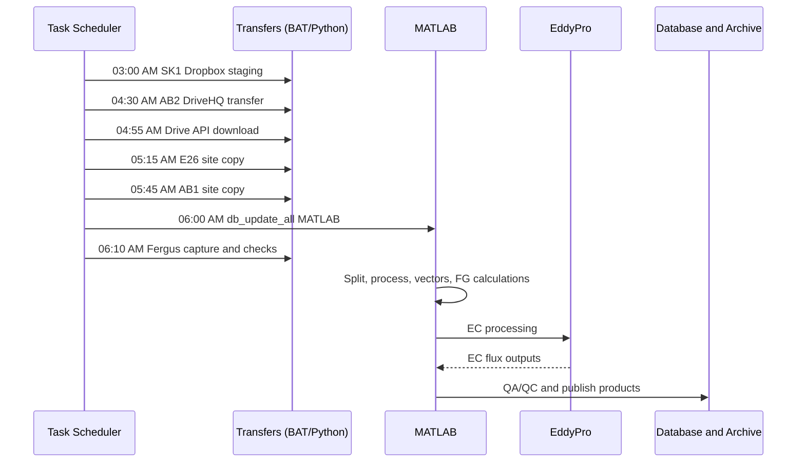

# Automation and Task Scheduler

Daily processing is orchestrated using **Windows Task Scheduler**.
Each scheduled task launches a batch (`.bat`) file that in turn calls
Python or MATLAB scripts.

## Scheduled Daily Tasks Overview



!!! "Tasks At-a-Glance"
    ```mermaid
    flowchart TB
        TS[Windows Task Scheduler]

        TS --> T1[03:00 AM<br>SK1 Dropbox staging]
        TS --> T2[04:30 AM<br>AB2 DriveHQ transfer]
        TS --> T3[04:55 AM<br>Drive API download]
        TS --> T4[05:15 AM<br>E26 site copy]
        TS --> T5[05:45 AM<br>AB1 site copy]
        TS --> T6[06:00 AM<br>db_update_all MATLAB]
        TS --> T7[06:10 AM<br>Fergus capture and checks]

        T1 --> P1[Raw ZIPs<br>to rawdata YYYYMMDD]
        T2 --> P2[Summary files<br>to staging]
        T3 --> P3[Drive files<br>to local staging]
        T4 --> P4[Unzip and organize<br>site files]
        T5 --> P5[Unzip and organize<br>site files]
        T6 --> M1[EC and FG<br>processing]
        T7 --> M2[Daily and weekly<br>diagnostics]
    ```


## Design rationale

- Data ingestion is separated from scientific processing
- Failures in one site do not block others
- Logs are written for traceability and recovery
