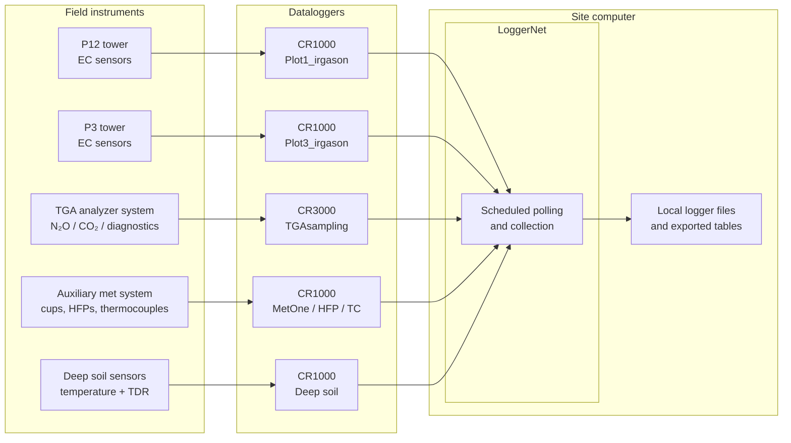
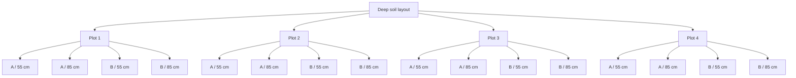

# Data Collection Workflows

This page documents how measurements are acquired at the ON1 field site, from instruments and dataloggers to the site computer, before the data enter the transfer and processing pipelines.

This is the **first layer** of the broader operational workflow:

> **Data Collection → Data Transfer → Processing (EC / FG) → QA/QC → Archive**

This page focuses on:

- which systems collect which measurements
- which dataloggers are connected to the site computer
- which data are collected automatically through LoggerNet
- which data still require manual retrieval
- what the main **output tables and variable groups** look like for each logger

For downstream movement of these files from the site computer to lab systems, see **[Data Transfer Workflows](data_transfer_workflows.md)** 

---

## 1. Collection Architecture

At ON1, multiple Campbell Scientific dataloggers collect data from eddy-covariance, flux-gradient, auxiliary meteorological, and soil-sensor systems. Most of these loggers are connected to the **site computer**, where **LoggerNet** is installed and used for scheduled data collection. One legacy shallow-soil logger is not part of the LoggerNet path and is retrieved manually in the field.



!!! note "Notes:"

    - The **dataloggers** are the field devices that perform measurement, local processing, and table storage.
    - The **site computer** is the field-side collection hub.
    - **LoggerNet** software retrieves supported logger tables and stores them locally for later transfer.
    - The shallow-soil CR23X logger is excluded from this automated path.

---

## 2. Logger Inventory and Roles

| Logger program | Logger model | Primary role | Main measurements / functions | Collection path | Notes |
| --- | --- | --- | --- | --- | --- |
| `Plot1_irgason_20260323.CR1` | CR1000 | EC tower logger (`P12_tower`) | High-frequency EC variables, online covariances, tower meteorology | LoggerNet | Shares table structure with Plot3 program. |
| `Plot3_irgason_20260323.CR1` | CR1000 | EC tower logger (`P3_tower`) | High-frequency EC variables, online covariances, tower meteorology | LoggerNet | Shares table structure with Plot1 program. |
| `TGAsampling_20260401.CR3` | CR3000 | FG / TGA system logger | TGA control, valve sequence, pressures, flows, diagnostics, site averages | LoggerNet | Acquisition-and-control logger, not just a passive recorder. |
| `CR1000_MetOne_010C_5_cups_HFP_TC_13June2024.CR1` | CR1000 | Auxiliary meteorological / surface logger | 5 cup anemometers, 2 soil heat flux plates, 4 thermocouples | LoggerNet | Produces 30-minute support tables. |
| `E26_Deep_CR1000_TDR_TC_V18Aug2021.CR1` | CR1000 | Deep soil logger | 16 deep soil temperature channels + 16 deep TDR channels | LoggerNet | Produces 10-minute TC and TDR profile tables plus logger stats. |
| `Pedro_shallow_P12_SRJ_20260323.dld` | CR23X | Legacy shallow soil logger | 8 shallow temperature channels + 8 shallow TDR-related channels | Manual | Not connected to LoggerNet on the site computer. |

!!! note "Notes:"

    - The **five automated loggers** are the two EC tower loggers, the TGA logger, the auxiliary met logger, and the deep-soil logger.
    - The automated collection path is based on Campbell Scientific **LoggerNet** installed on the site computer. 
    - LoggerNet periodically polls supported dataloggers and stores their exported data tables locally.
    - The site computer acts as a **staging point** for downstream transfer scripts and workflows.
    - The **manual logger** is the shallow-soil **CR23X** system.
    - The shallow-soil **CR23X** system is not supported by the LoggerNet version installed on the site computer. As a result, the shallow-soil workflow remains manual.

---

## 3. Logger Output Tables and Variable Structure

This section summarizes the main output tables and variable groups for each logger. 

### 3.1 EC Tower Loggers (`Plot1_irgason` and `Plot3_irgason`)

The two EC tower programs appear to use the **same overall variable and table structure**. The main difference visible in the logger code is the tower-specific configuration, such as `CSAT3_AZIMUTH`. The data structure of the two EC logger programs is otherwise the same.

#### Core high-frequency variable array

Both EC tower programs define a 13-element `sonic_irga` array with the following aliases:

| Array element | Alias | Interpretation |
| --- | --- | --- |
| `sonic_irga(1)` | `Ux_ir` | X wind component |
| `sonic_irga(2)` | `Uy_ir` | Y wind component |
| `sonic_irga(3)` | `Uz_ir` | Z wind component |
| `sonic_irga(4)` | `Ts_ir` | Sonic temperature |
| `sonic_irga(5)` | `diag_sonic_ir` | Sonic diagnostic |
| `sonic_irga(6)` | `CO2_uncorr_ir` | Uncorrected CO₂ |
| `sonic_irga(7)` | `H2O_ir` | Water vapor |
| `sonic_irga(8)` | `diag_irga_ir` | IRGA diagnostic |
| `sonic_irga(9)` | `cell_tmpr_ir` | IRGA cell temperature |
| `sonic_irga(10)` | `cell_press_ir` | IRGA cell pressure |
| `sonic_irga(11)` | `CO2_sig_strgth_ir` | CO₂ signal strength |
| `sonic_irga(12)` | `H2O_sig_strgth_ir` | H₂O signal strength |
| `sonic_irga(13)` | `CO2_ir` | Corrected / main CO₂ channel |

#### Supporting meteorological variables

Both EC programs also define supporting variables/groups such as:

| Variable/group | Interpretation |
| --- | --- |
| `batt_volt`, `panel_temp` | Logger health / system status |
| `AirTC_H`, `RH_H` | Air temperature and relative humidity from HMP50-style input |
| `CNR1(1..7)` | Net radiometer-related channels (`CM3Up`, `CM3Dn`, `CG3Up`, `CG3Dn`, `CNR1TC`, `CG3UpCo`, `CG3DnCo`) |
| `Albedo` | Derived albedo term |
| `Hs`, `Fc_irga`, `LE_irga`, `tau`, `u_star` | Derived online flux / turbulence terms |

#### Online covariance output array

Both programs define a 17-element `cov_out` array:

| Array element | Alias | Interpretation |
| --- | --- | --- |
| `cov_out(1)` | `cov_Uz_Uz` | Vertical wind variance |
| `cov_out(2)` | `cov_Ux_Uz` | Covariance of Ux and Uz |
| `cov_out(3)` | `cov_Uy_Uz` | Covariance of Uy and Uz |
| `cov_out(4)` | `cov_Ts_Uz` | Covariance of Ts and Uz |
| `cov_out(5)` | `cov_co2_co2` | CO₂ variance |
| `cov_out(6)` | `cov_co2_Uz` | CO₂–Uz covariance |
| `cov_out(7)` | `cov_h2o_h2o` | H₂O variance |
| `cov_out(8)` | `cov_h2o_Uz` | H₂O–Uz covariance |
| `cov_out(9)` | `Ts_mean` | Mean sonic temperature |
| `cov_out(10)` | `H2O_mean` | Mean H₂O concentration |
| `cov_out(11)` | `co2_mean` | Mean CO₂ concentration |
| `cov_out(12)` | `press_mean` | Mean pressure |
| `cov_out(13)` | `wnd_spd_compass` | Wind speed in compass coordinates |
| `cov_out(14)` | `wnd_dir_compass` | Wind direction in compass coordinates |
| `cov_out(15)` | `wnd_spd` | Wind speed |
| `cov_out(16)` | `wnd_dir_csat3` | CSAT3-relative wind direction |
| `cov_out(17)` | `std_wnd_dir` | Standard deviation of wind direction |

#### EC output tables

| Table | Interval | Contents |
| --- | --- | --- |
| `RawData` | 100 msec | 13 high-frequency `sonic_irga` channels |
| `ProcssData` | 30 min | Means, standard deviations, diagnostics, covariance samples, wind metrics, derived flux/turbulence terms, logger status, CNR1 averages, HMP variables |
| `comp_cov` | 30 min | Working covariance calculations, mean scalar values, wind vector terms |

---

### 3.2 TGA / FG Logger (`TGAsampling`)

The TGA CR3000 program is more complex than the other loggers because it controls the analyzer and valve sequencing in addition to data storage. For that reason, it is more useful to organize the variable description by **functional group** rather than listing every field in a single long table.

#### Functional role

This logger manages:

- TGA communication
- pressure control
- valve sequencing
- sample / bypass flow monitoring
- system-status messaging
- high-frequency and averaged storage tables

#### Main variable groups

| Variable group | Examples | Interpretation |
| --- | --- | --- |
| Sequence control | `ValveSequence`, `OnTime`, `OmitTime`, `omit_cnts`, `seq_ACTIVE` | Defines and manages valve switching logic |
| Status / messaging | `latest_note`, `mode_status`, `system_status`, `TGA_status`, `diag_system` | Operational state and troubleshooting messages |
| Flow and pressure | `SampleFlow`, `ExcessFlow`, `SamplePress`, `BypassPress`, `SampleP_control`, `BypassP_control`, `TGAPress_control` | Core pneumatic / control variables |
| TGA analyzer array | `TGAData(...)` | Main analyzer outputs, depends on gas configuration |
| Power / logger health | `panel_tmpr`, `batt_volt`, `buff_depth` | Logger/system state |
| Optional interfaces | `Li64...`, `CO2mixerData` | Optional external interfaces if enabled |

#### `TGAData` analyzer variables for the current gas setting

The program is configured with:

- `GAS_TYPE = GAS_N2OnCO2`
- `SEQ_TYPE = SEQ_GRADIENT_Seq`

For this gas type, the visible `TGAData` aliases include:

| Alias | Interpretation |
| --- | --- |
| `Conc12C`, `Conc13C`, `Conc18O` | Concentration-style analyzer outputs `[VERIFY!]` |
| `TGAStatus` | Analyzer status code |
| `TGAPressure` | Internal TGA pressure |
| `LaserTemp` | Laser temperature |
| `DCCurrentA`, `DCCurrentB`, `DCCurrentC` | DC currents for scan ramps |
| `TGAAnalog1` | General analog input / monitor |
| `TGATemp1`, `TGATemp2` | Internal temperatures |
| `LaserCooler` | Laser cooling control / state |
| `RefDetSigA/B/C`, `RefDetTransA/B/C`, `RefDetTemp`, `RefDetCooler`, `RefDetGainOffset` | Reference detector diagnostics |
| `SmpDetSigA/B/C`, `SmpDetTransA/B/C`, `SmpDetTemp`, `SmpDetCooler`, `SmpDetGainOffset` | Sample detector diagnostics |
| `TGATemp1DutyCycle`, `TGATemp2DutyCycle` | Temperature-control duty-cycle terms |

#### TGA output tables

| Table | Trigger / interval | Contents |
| --- | --- | --- |
| `RawData` | 10 Hz | High-frequency raw analyzer / control data |
| `OneSec` | 1 sec | One-second averaged diagnostic / analyzer table |
| `SiteAvg` | One record per completed site / valve step | Primary site-average output table; includes valve number, number of samples, averaged TGA data, flows, pressures, controls, battery/panel state, standard deviations |
| `TimeInfo` | Small configuration table | Sequence length, sequence time, sync interval, valve sequence, on-times, omit-times |
| `message_log` | Logged status messages | Troubleshooting / system messages |
| `CO2mixerOneSec` | Optional | Only used if CO₂ mixer interface is enabled |

---

### 3.3 Auxiliary Meteorological Logger (`CR1000_MetOne_010C_5_cups_HFP_TC`)

#### Declared variables

| Variable | Interpretation |
| --- | --- |
| `BattV` | Battery voltage |
| `PTemp_C` | Logger panel temperature |
| `Cup_1` to `Cup_5` | Cup-anemometer channels |
| `Temp_C(1..4)` | Thermocouple channels |
| `SHF` | Soil heat flux plate 1 |
| `SHF_2` | Soil heat flux plate 2 |

#### Output tables

| Table | Interval | Variables / contents |
| --- | --- | --- |
| `Cups_All` | 30 min | `BattV`, `PTemp_C`, `Cup_1` to `Cup_5` averages |
| `HFP_1` | 30 min | `SHF`, `Temp_C(1)`, `Temp_C(2)` averages |
| `HFP_2` | 30 min | minimum `BattV`, `SHF_2`, `Temp_C(3)`, `Temp_C(4)` averages |

!!! note "Notes:"

    - The main scan is 1 second.
    - Cup channels are pulse-count-based wind measurements.
    - The logger applies a low-speed threshold: any instantaneous reading below 0.28 m/s is set to zero (`If Cup_X < 0.28 Then Cup_X = 0`). This corresponds to the MetOne 010C start threshold and explains the zero values that appear in the data during calm conditions.

---

### 3.4 Deep Soil Logger (`E26_Deep_CR1000_TDR_TC`)

#### Declared variables

| Variable/group | Interpretation |
| --- | --- |
| `BattV`, `PTemp_C` | Logger health / status |
| `VW(1..16)` | Calculated volumetric water content values |
| `PA_uS(1..16)` | Raw / intermediate CS616 period values (microseconds) |
| `RTempC` | Reference temperature |
| `Temp_C(1..16)` | Thermocouple temperature values |

#### Deep-soil layout logic

- **4 plots**
- **2 replicated positions per plot**
- **2 depths per replicated position**
- **55 cm**
- **85 cm**

This produces 16 temperature and 16 TDR entries.

#### Deep soil output tables

| Table | Interval | Contents |
| --- | --- | --- |
| `Deep_TDR` | 10 min | 16 deep-soil water content (`VW_...`) values plus matching `PA_uS_...` values |
| `Deep_TC` | 10 min | 16 deep-soil temperature values |
| `LoggerStats` | 1440 min (daily) | minimum battery voltage and panel temperature |

#### `Deep_TDR` variable mapping

| Plot | Position / depth | Variables |
| --- | --- | --- |
| P1 | 55A | `VW_P1_55A`, `PA_uS_P1_55A` |
| P1 | 85A | `VW_P1_85A`, `PA_uS_P1_85A` |
| P1 | 55B | `VW_P1_55B`, `PA_uS_P1_55B` |
| P1 | 85B | `VW_P1_85B`, `PA_uS_P1_85B` |
| P2 | 55A | `VW_P2_55A`, `PA_uS_P2_55A` |
| P2 | 85A | `VW_P2_85A`, `PA_uS_P2_85A` |
| P2 | 55B | `VW_P2_55B`, `PA_uS_P2_55B` |
| P2 | 85B | `VW_P2_85B`, `PA_uS_P2_85B` |
| P3 | 55A | `VW_P3_55A`, `PA_uS_P3_55A` |
| P3 | 85A | `VW_P3_85A`, `PA_uS_P3_85A` |
| P3 | 55B | `VW_P3_55B`, `PA_uS_P3_55B` |
| P3 | 85B | `VW_P3_85B`, `PA_uS_P3_85B` |
| P4 | 55A | `VW_P4_55A`, `PA_uS_P4_55A` |
| P4 | 85A | `VW_P4_85A`, `PA_uS_P4_85A` |
| P4 | 55B | `VW_P4_55B`, `PA_uS_P4_55B` |
| P4 | 85B | `VW_P4_85B`, `PA_uS_P4_85B` |

#### `Deep_TC` variable mapping

| Plot | Position / depth | Temperature field |
| --- | --- | --- |
| P1 | 55A | `TempP_C_P1_55A` |
| P1 | 85A | `Temp_C_P1_85A` |
| P1 | 55B | `Temp_C_P1_55B` |
| P1 | 85B | `Temp_C_P1_85B` |
| P2 | 55A | `Temp_C_P2_55A` |
| P2 | 85A | `Temp_C_P2_85A` |
| P2 | 55B | `Temp_C_P2_55B` |
| P2 | 85B | `Temp_C_P2_85B_` |
| P3 | 55A | `Temp_C_P3_55A` |
| P3 | 85A | `Temp_C_P3_85A` |
| P3 | 55B | `Temp_C_P3_55B` |
| P3 | 85B | `Temp_C_P3_85B` |
| P4 | 55A | `Temp_C_P4_55A` |
| P4 | 85A | `Temp_C_P4_85A` |
| P4 | 55B | `Temp_C_P4_55B` |
| P4 | 85B | `Temp_C_P4_85B` |

#### Conceptual deep-soil layout



---

### 3.5 Shallow Soil Logger (`Pedro_shallow...` / CR23X)

#### Declared / labeled variables

| Variable/group | Interpretation |
| --- | --- |
| `BattV`, `ProgSig`, `PTemp_C` | Logger status / health |
| `Temp_C_1` to `Temp_C_8` | 8 shallow temperature channels |
| `VW`, `VW_2` ... `VW_8` | 8 shallow water-content channels `[VERIFY!]` |
| `PA_uS`, `PA_uS_2` ... `PA_uS_8` | 8 period / TDR timing channels |

#### Output tables

| Table | Interval | Contents |
| --- | --- | --- |
| `301 Output_Table` | 10 min | Timestamp fields, battery / program values, 8 temperature averages, 8 `PA_uS` averages |
| `102 Output_Table` | 1440 min | Daily battery minimum and program signature |

!!! note "Notes:"

    - The main output is a **10-minute** table.
    - The workflow is **manual**, not LoggerNet-based.
    - The CR23X exports data in a **positional ASCII format** that differs fundamentally from the TOA5 format used by CR1000/CR3000 loggers. Rather than a four-row named header, each record begins with an integer table-type identifier (`301` for the 10-minute output table, `102` for the daily stats table), followed by year, day-of-year, and time (HHMM), then the data columns in fixed order. There are no column-name headers in the file. The no-data sentinel value is `-6999`. New users opening these files should be aware of this format difference before attempting to parse them.

---

## 4. Collection Logic (Conceptual Pseudocode)

```text
FOR each field datalogger:
    measure connected sensors according to logger scan program
    write values to logger memory and output tables

FOR each LoggerNet-supported logger:
    at scheduled collection times:
        poll logger from site computer
        retrieve new table records
        save exported files locally on the site computer

FOR each non-LoggerNet legacy logger:
    during field visit:
        connect field laptop to logger
        manually download records
        manually hand off downloaded files into the downstream data-transfer path
```

---

## 5. Next Workflow Stage

This page covers the **collection layer only**.

After collection:

- LoggerNet-supported outputs reside on the **site computer**
- shallow-soil legacy outputs reside on a **field laptop until manually moved**
- both then feed into the **Data Transfer Workflow**

See **[Data Transfer Workflows](data_transfer_workflows.md)** for the next stage in the operational chain.

