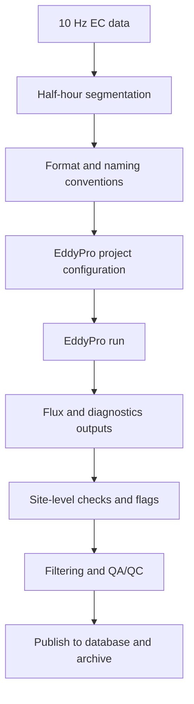

# Eddy Covariance Processing Pipeline

The **Eddy Covariance (EC)** branch of the processing system.

## Scope & overview

- High-frequency (typically 10 Hz) EC data
- Half-hour segmentation
- Flux calculation using EddyPro
- Post-processing and filtering prior to archiving

## Notes

- Instrument-specific details (e.g., IRGASON, CSAT3, LI-7500) are handled upstream
- The EC workflow is largely external to the MATLAB db_* system
- Outputs are synchronized with FG products for unified archiving

Continue to the detailed [Eddy-Covariance Analysis](../eddy-covariance/fundamentals.md) to learn about the  setup and context.
