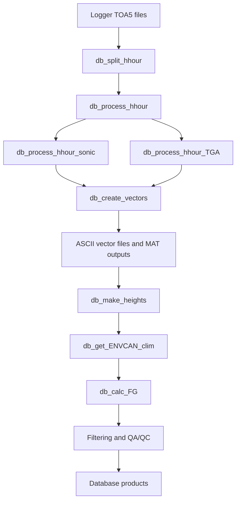

# Flux-Gradient Processing Pipeline

The **Flux-Gradient (FG)** processing chain implemented primarily in MATLAB:

## Notes

- The main entry point is `db_update_site.m`
- Site behavior is controlled by the site specific initialization script `<SITE>_init_all.m`
- MATLAB (`.mat`) structure files and ASCII output vector files are generated for diagnostics, sharing and subsequent archiving

Continue to the detailed [Flux-Gradient Analysis](../flux-gradient/processing-pipeline.md) to learn about the  setup and context.
