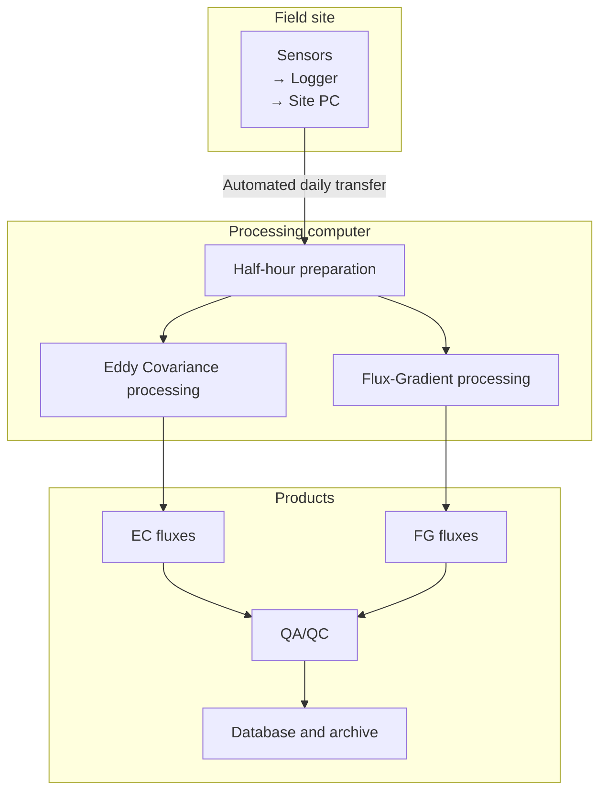

# Overview of the Processing Workflow

This section provides a high-level overview of the end-to-end data-processing workflow
used in the CanN2Onet project, from field sensors to archived flux products.

The goal is to document **how data flow through the system**, not to re-derive
eddy-covariance or flux-gradient theory (which is available in standard references).

## Conceptual data flow

## Key characteristics

- Fully automated daily processing on a Windows workstation
- Combination of Python, MATLAB, and EddyPro workflows
- Site-specific configuration via initialization scripts
- ASCII vector outputs used as an intermediate archival format
